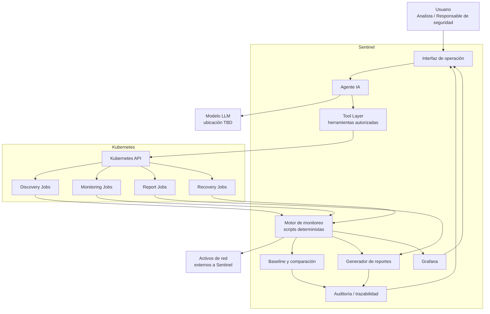
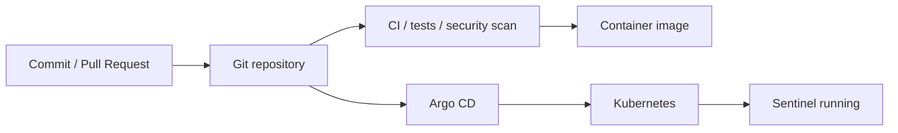
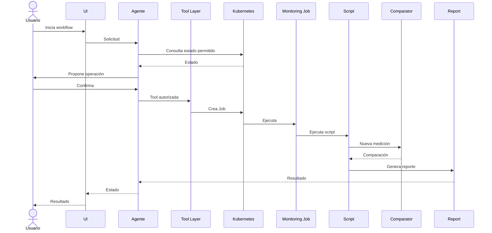
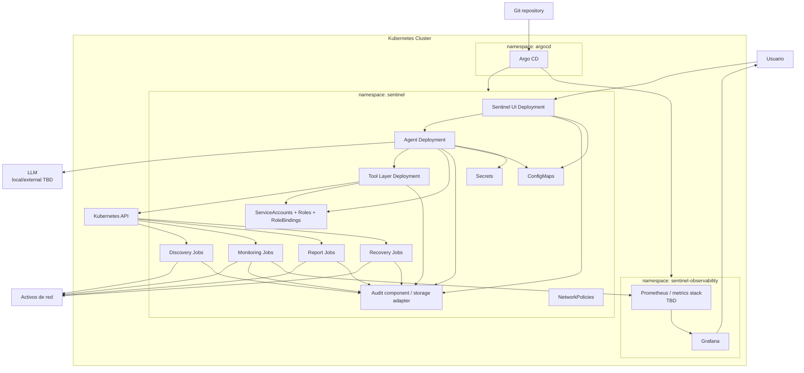

# Arquitectura técnica — Sentinel

> **Estado:** Documento de arquitectura consolidado para el repositorio del proyecto.
>
> **Producto:** Sentinel
>
> **Base:** PRD aprobado + decisiones aprobadas durante la co-creación + Prompt 2 de Arquitectura técnica.
>
> **Convención:** Las decisiones derivadas directamente del PRD se consideran parte del diseño aprobado. Las decisiones técnicas que permanecen abiertas se marcan como `[TBD]`. Las propuestas internas de implementación se marcan como `[INTERNO]` y deberán validarse durante la construcción del MVP.

---

## 0. Propósito y alcance

Este documento define la arquitectura técnica de Sentinel como una plataforma **self-hosted de monitoreo de activos de red y orquestación operacional mediante un agente de IA sobre Kubernetes**.

La arquitectura debe preservar las decisiones fundamentales del PRD:

- Kubernetes es el plano central de orquestación.
- El agente de IA funciona como orquestador operacional.
- El agente no actúa directamente sobre los activos.
- El agente interactúa únicamente con Kubernetes y herramientas autorizadas.
- Las operaciones ejecutables requieren confirmación humana cuando corresponde.
- La lógica de monitoreo y comparación es determinista y externa al LLM.
- Los reportes de monitoreo son generados por scripts, principalmente Shell Script, en texto plano.
- Grafana es la capa de visualización.
- La ejecución de workloads de monitoreo se realiza mediante Jobs/Pods de Kubernetes.
- La arquitectura debe permitir comparar el workflow con agente y el mismo workflow sin agente.

### 0.1 Hipótesis arquitectónica

> **La arquitectura de Sentinel debe permitir demostrar que una capa de agente de IA reduce el tiempo y esfuerzo operacional del workflow de monitoreo sin degradar la seguridad, la integridad de la evidencia ni el control humano.**

### 0.2 Fuera del alcance arquitectónico del MVP

No se diseñan como capacidades del MVP:

- detección automática de nuevos activos;
- respuesta autónoma ante ataques;
- bloqueo automático de dispositivos o puertos;
- acceso directo del agente a endpoints;
- detección de ataques mediante LLM;
- comparación de baseline mediante LLM;
- generación narrativa del reporte mediante IA;
- shell arbitrario para el agente;
- SIEM completo;
- NMS completo;
- alta disponibilidad empresarial;
- multi-tenancy.

---

# 1. Diagrama de componentes

## 1.1 Arquitectura lógica



## 1.2 Responsabilidad de cada componente

| Componente | Responsabilidad | IA | Acceso directo a activos |
|---|---|---:|---:|
| Usuario | Inicia workflows, revisa propuestas y autoriza operaciones | No | No |
| UI | Interacción operacional y visualización de resultados | No | No |
| Agente IA | Orquestación, selección de tools, manejo de workflow y escalamiento | Sí | **No** |
| Modelo LLM | Procesamiento generativo del contexto del agente | Sí | No |
| Tool Layer | Delimitar y validar capacidades disponibles al agente | No | Indirecto, mediante tools |
| Kubernetes API | Plano de ejecución y control de workloads | No | No |
| Discovery Jobs | Ejecutar discovery autorizado | No | Sí, mediante herramientas/scripts |
| Monitoring Jobs | Ejecutar mediciones | No | Sí, mediante herramientas/scripts |
| Report Jobs | Ejecutar generación de reportes | No | Indirecto |
| Recovery Jobs | Ejecutar recuperación controlada | No | Mediante herramientas/scripts |
| Monitoring scripts | Generar evidencia de monitoreo | No | Sí, mediante la red |
| Baseline/Comparator | Comparar estados y determinar cambios | No | No |
| Report generator | Generar registros de texto plano | No | No |
| Grafana | Visualización de métricas y actividad | No | No |
| Auditoría | Registrar operaciones y resultados | No | No |

## 1.3 División de responsabilidades

```text
Usuario
  → inicia / revisa / autoriza

Agente IA
  → interpreta contexto operacional
  → propone siguiente operación
  → solicita autorización
  → llama una tool autorizada

Tool Layer
  → limita capacidades
  → valida parámetros
  → registra la ejecución

Kubernetes
  → aplica permisos
  → crea/ejecuta workloads
  → controla su ciclo de vida

Scripts
  → generan mediciones y evidencia
  → generan reportes de texto plano

Comparator
  → determina cambios

Grafana
  → visualiza

Auditoría
  → conserva trazabilidad
```

---

# 2. Límites de confianza y fronteras arquitectónicas

## 2.1 Frontera de autonomía

La regla estructural es:

> **El agente no puede actuar directamente sobre los activos. Solo puede interactuar con Kubernetes y herramientas autorizadas, y las operaciones definidas como ejecutables requieren confirmación humana.**

La ruta permitida es:

```text
Agente IA
   ↓
Tool Layer
   ↓
validación / autorización
   ↓
Kubernetes API
   ↓
Job / Pod
   ↓
script / herramienta autorizada
   ↓
activo
```

La ruta prohibida es:

```text
Agente IA ───────────────X────────────→ Activo
```

Y también:

```text
Agente IA ───────────────X────────────→ shell arbitrario
```

## 2.2 Separación entre instrucciones y datos

Los resultados de herramientas, logs, nombres de activos, metadata y reportes deben tratarse como **datos no confiables** desde el punto de vista del agente.

Se deben distinguir al menos tres clases de información:

```text
Instrucciones del sistema
        ≠
Instrucciones del workflow
        ≠
Datos provenientes de herramientas / activos
```

Un texto procedente de un activo no adquiere autoridad por estar dentro del contexto del agente.

## 2.3 Separación entre IA y evidencia

```text
LLM
  → decide / propone / coordina

Scripts
  → miden / registran / generan evidencia

Comparator
  → determina cambios
```

La IA no fabrica la evidencia ni sustituye los registros originales.

---

# 3. Modelo de despliegue Kubernetes

## 3.1 Namespaces

La propuesta inicial `[INTERNO]` es separar la plataforma funcional de herramientas de administración y del sistema GitOps:

```text
cluster
├── sentinel
├── sentinel-observability
└── argocd
```

### `sentinel`

Contendrá los componentes funcionales de Sentinel:

- UI;
- Agente IA;
- Tool Layer;
- Jobs de discovery;
- Jobs de monitoreo;
- Jobs de reportes;
- Jobs de recuperación;
- componentes de configuración;
- componentes de auditoría.

### `sentinel-observability`

Contendrá, cuando se utilicen como workloads propios del proyecto:

- Grafana;
- Prometheus y componentes asociados `[TBD]`.

### `argocd`

Contendrá Argo CD para el flujo GitOps `[INTERNO]`.

> **Nota:** La cantidad definitiva de namespaces puede reducirse en el MVP si la separación añade complejidad sin beneficio demostrable.

---

## 3.2 Workloads de larga duración

### Agent Deployment

Responsabilidad:

- recibir solicitudes;
- gestionar contexto;
- interactuar con el LLM;
- ejecutar tools autorizadas;
- gestionar el workflow;
- solicitar confirmaciones;
- registrar resultados.

### UI Deployment

Responsabilidad:

- interfaz web;
- interacción con el agente;
- visualización de estado;
- acceso a reportes e historial.

### Tool Layer Deployment

**Propuesta `[INTERNO]`:** mantener la Tool Layer como componente aislado del agente para poder imponer una frontera técnica adicional entre razonamiento y ejecución.

Responsabilidad:

- exponer únicamente tools autorizadas;
- validar parámetros;
- autorizar llamadas;
- invocar Kubernetes;
- registrar tool calls.

### Grafana Deployment

Responsabilidad:

- visualización de métricas y actividad.

### Prometheus

**Estado:** `[TBD]` como arquitectura de implementación definitiva.

Cuando sea utilizado, su responsabilidad será recopilar y consultar métricas necesarias para Grafana.

---

## 3.3 Workloads de ejecución temporal

### Discovery Job

Ejecuta el mecanismo de descubrimiento bajo demanda.

### Monitoring Job

Ejecuta las mediciones correspondientes al workflow.

### Report Job

Genera los registros de texto plano mediante scripts.

### Recovery Job

Se utiliza cuando el workflow requiere el mecanismo de recuperación definido.

Los Jobs son preferibles a mantener procesos de monitoreo de corta duración permanentemente activos cuando el workflow requiere una ejecución con inicio y final explícitos.

---

## 3.4 StatefulSets

**No se requieren StatefulSets para los workloads funcionales definidos actualmente.** `[INTERNO]`

Los componentes persistentes no se han definido todavía como servicios con identidad ordinal o almacenamiento dedicado por réplica.

Si una decisión posterior introduce un componente que necesite identidad estable por réplica, esta decisión deberá revisarse mediante una ADR.

---

## 3.5 Services

Los Services previstos son:

| Service | Tipo conceptual | Propósito |
|---|---|---|
| `sentinel-ui` | ClusterIP | Exponer UI internamente dentro del clúster |
| `sentinel-agent` | ClusterIP | Comunicación UI/otros componentes con el agente |
| `sentinel-tools` | ClusterIP | Comunicación interna con Tool Layer |
| `grafana` | ClusterIP | Acceso interno a Grafana |
| Prometheus | ClusterIP | Acceso interno a métricas `[TBD]` |

No se expone directamente al exterior ningún Service de Jobs de monitoreo.

---

## 3.6 Ingress

La necesidad de Ingress depende de la forma final de acceso al MVP.

### Opciones

**A. Ingress dentro del clúster** `[INTERNO]`

```text
usuario → Ingress → UI
```

**B. Acceso local mediante port-forward** `[INTERNO]`

```text
usuario → kubectl port-forward → UI
```

**C. Service de tipo NodePort** `[INTERNO]`

Adecuado únicamente para una demostración controlada.

### Decisión provisional

> **`[TBD]` — mecanismo de publicación de la UI.**

La decisión dependerá del entorno Kubernetes concreto utilizado para el laboratorio y de si se requiere acceso desde otros equipos de la red local.

---

# 4. Configuración y secretos

## 4.1 Principio

Los secretos **nunca deben formar parte de la imagen de contenedor**.

No deben almacenarse en:

- Dockerfiles/Containerfiles;
- código fuente;
- scripts versionados;
- prompts del agente;
- manifests con valores secretos en texto plano.

## 4.2 Configuración no sensible

Se utilizarán `ConfigMap` o mecanismos equivalentes para parámetros no sensibles.

Ejemplos:

```text
MONITOR_INTERVAL=5
BASELINE_SAMPLES=5
REPORT_FORMAT=plain_text
```

Los valores exactos podrán cambiar durante las pruebas `[TBD]`.

## 4.3 Secretos

Se utilizarán `Secret` de Kubernetes para secretos requeridos por el sistema.

Ejemplos potenciales:

- credenciales del modelo externo `[TBD]`;
- credenciales de servicios externos `[TBD]`;
- credenciales administrativas de componentes que realmente las necesiten.

Los Secrets no deben aparecer dentro de prompts.

## 4.4 Cifrado en Git

El repositorio GitOps no debe almacenar Secrets en claro.

### Opciones consideradas

| Opción | Descripción | Estado |
|---|---|---|
| SOPS + age | Cifrado de manifiestos/valores antes del commit | `[TBD]` |
| Sealed Secrets | Secrets cifrados y gestionados para Kubernetes | `[TBD]` |
| Secret manager externo | Secretos fuera del repositorio | `[TBD]` |

### Decisión provisional

> **`[TBD]` — mecanismo de cifrado/gestión de Secrets en Git.**

Para el MVP debe existir, como mínimo, una prueba de que ningún secreto real termina versionado en texto plano.

---

# 5. Modelo de permisos y RBAC

## 5.1 Principio de mínimo privilegio

Cada componente debe disponer únicamente de los permisos requeridos para su responsabilidad.

El agente es especialmente restringido porque dispone de capacidad de invocar herramientas y actuar sobre el plano Kubernetes.

## 5.2 ServiceAccounts

Propuesta `[INTERNO]`:

```text
sentinel-agent-sa
sentinel-tools-sa
sentinel-monitoring-sa
sentinel-report-sa
```

No se reutilizará automáticamente una única ServiceAccount para todos los workloads.

## 5.3 Modelo de autorización

```text
Usuario
  ↓
UI / workflow
  ↓
Agente
  ↓
Tool Layer
  ↓
ServiceAccount del componente
  ↓
RBAC Kubernetes
  ↓
recurso permitido
```

## 5.4 Matriz conceptual

| Componente | Tipo de permiso | Alcance inicial |
|---|---|---|
| Agent | Lectura de estado | Recursos explícitamente necesarios |
| Agent | Creación de Jobs | Solo Jobs de workflows permitidos |
| Agent | Eliminación de Jobs/Pods | Solo recursos que el workflow permita administrar |
| Agent | Modificación de configuración | Solo ConfigMaps autorizados `[TBD]` |
| Tool Layer | Acceso a API Kubernetes | Solo operaciones declaradas |
| Monitoring Jobs | Sin permisos de administración del clúster | Mínimos o ninguno |
| Report Jobs | Acceso únicamente al almacenamiento/recurso requerido | Mínimo |
| Grafana | Lectura de métricas | Solo fuentes configuradas |
| UI | No administración del clúster | Ninguna |

La lista exacta de `apiGroups`, `resources` y `verbs` deberá definirse a partir de las herramientas reales y no inventarse antes de implementarlas.

## 5.5 Restricción crítica del agente

Debe poder demostrarse que:

```text
Agent
 ├── can → operación permitida
 └── cannot → operación no permitida
```

### Verificación

Se utilizarán comprobaciones equivalentes a:

```bash
kubectl auth can-i --as=system:serviceaccount:sentinel:sentinel-agent-sa get pods
kubectl auth can-i --as=system:serviceaccount:sentinel:sentinel-agent-sa create jobs
kubectl auth can-i --as=system:serviceaccount:sentinel:sentinel-agent-sa delete deployments
```

Los recursos concretos se sustituirán por los realmente usados durante la implementación.

La evidencia debe demostrar tanto permisos permitidos como permisos denegados.

---

# 6. Estrategia de datos

## 6.1 Tipos de datos

Sentinel maneja, como mínimo, cuatro grupos de datos:

### A. Evidencia de monitoreo

- IP;
- MAC;
- OS;
- puertos;
- servicios;
- tiempo;
- tráfico;
- protocolo;
- IP origen/destino.

### B. Estado/base de comparación

- estado inicial;
- estado anterior;
- estado actual;
- resultado de comparación.

### C. Auditoría

- timestamp;
- usuario;
- workflow;
- herramienta;
- parámetros;
- confirmación;
- resultado;
- error;
- número de intento;
- recurso Kubernetes.

### D. Datos del agente

- contexto operacional necesario;
- tool calls;
- resultados de tools;
- mensajes operacionales.

---

## 6.2 Persistencia

La persistencia exacta de reportes y auditoría permanece como:

> **`[TBD]`**

### Opciones consideradas

**A. PVC con almacenamiento de archivos**

Adecuado para el MVP por simplicidad.

**B. Base de datos**

Mayor capacidad de consulta, pero aumenta complejidad del stack.

**C. Object storage**

Adecuado para artefactos/reportes, pero agrega otro servicio.

### Decisión provisional

> **Para el MVP se prioriza una solución de persistencia simple y local; la tecnología definitiva debe cerrarse después de validar el patrón real de escritura/lectura.** `[INTERNO]`

---

## 6.3 PVC

Si se utiliza almacenamiento persistente de archivos, se implementará mediante PVC.

Conceptualmente:

```text
sentinel-data-pvc
       ↓
report / audit storage
```

### StorageClass

> **`[TBD]` — depende de la distribución Kubernetes del laboratorio.**

No se asume una StorageClass concreta hasta conocer el entorno de despliegue final.

---

## 6.4 Persistencia de Jobs

Los Jobs deben ser temporales en cuanto a ejecución, pero sus resultados importantes deben transferirse al mecanismo de persistencia/auditoría definido.

No se considera el Pod del Job como almacenamiento permanente de evidencia.

---

## 6.5 Respaldos

La estrategia de respaldo del MVP queda:

> **`[TBD]`**

Como mínimo, deben poder respaldarse:

- reportes;
- auditoría;
- configuración persistente;
- artefactos requeridos para reproducir el estado de Sentinel.

La frecuencia y mecanismo exactos dependen del backend de persistencia que se seleccione.

---

# 7. Observabilidad

La observabilidad debe permitir verificar tanto el **funcionamiento de Sentinel** como el comportamiento del agente.

## 7.1 Métricas del agente

Métricas propuestas `[INTERNO]`:

```text
agent_workflows_started_total
agent_workflows_completed_total
agent_workflows_failed_total
agent_tool_calls_total
agent_tool_calls_rejected_total
agent_tool_calls_authorized_total
agent_human_approvals_total
agent_human_rejections_total
agent_retry_total
agent_escalations_total
agent_workflow_duration_seconds
```

Estas métricas no sustituyen las métricas de evaluación de IA; sirven para observar operacionalmente el sistema.

## 7.2 Métricas de Tool Layer

```text
tool_calls_total
tool_calls_success_total
tool_calls_error_total
tool_calls_validation_rejected_total
tool_execution_duration_seconds
```

## 7.3 Métricas de workloads

```text
monitoring_jobs_total
monitoring_jobs_failed_total
monitoring_jobs_duration_seconds
report_jobs_total
report_jobs_failed_total
discovery_jobs_total
```

## 7.4 Métricas de monitoreo

El dominio funcional producirá las métricas de tráfico y actividad que correspondan al workflow.

Para tráfico:

```text
bytes/s
source IP
destination IP
protocol
```

El umbral exacto para determinar una desviación del comportamiento esperado permanece `[TBD]`.

---

## 7.5 Logs

Todos los componentes deberán emitir logs principalmente por `stdout/stderr`, para que Kubernetes pueda gestionarlos de forma nativa.

Los logs relevantes deberán permitir reconstruir:

```text
workflow
→ tool call
→ parámetros
→ autorización
→ Job/Pod
→ resultado
→ reintento
→ escalamiento
```

Se recomienda utilizar JSON estructurado para logs de la plataforma `[INTERNO]`, manteniendo los reportes de monitoreo en el formato de texto plano definido por el producto.

Es decir:

```text
LOG OPERACIONAL
→ estructurado / JSON

REPORTE DE MONITOREO
→ texto plano mediante SH
```

---

## 7.6 Trazas

Distributed tracing no es una necesidad funcional del MVP.

> **OpenTelemetry/tracing: `[TBD]` / fuera del MVP inicial.**

Podrá incorporarse posteriormente si la arquitectura termina distribuyendo una cantidad de servicios suficiente para que el tracing aporte valor observable.

---

# 8. Políticas de admisión y hardening

## 8.1 Pod Security

Los workloads de Sentinel deben seguir, como mínimo, una postura equivalente al nivel **Restricted** de Pod Security Standards cuando sea compatible con las herramientas utilizadas.

Controles esperados:

- no ejecutar como root;
- capacidades Linux mínimas;
- seccomp apropiado;
- filesystem de solo lectura cuando sea viable;
- ausencia de `privileged: true`;
- no utilizar host networking salvo justificación explícita;
- no utilizar host PID/IPC salvo justificación explícita.

## 8.2 Network Policies

La comunicación entre componentes deberá restringirse mediante políticas de red cuando el CNI disponible lo permita.

Ejemplo conceptual:

```text
UI
 ↓ permitido → Agent

Agent
 ↓ permitido → Tool Layer

Tool Layer
 ↓ permitido → Kubernetes API

Jobs
 ↓ permitido → destino de monitoreo
```

El acceso de cada workload a cualquier otro namespace deberá estar denegado por defecto cuando sea viable.

## 8.3 Recursos

Los workloads deben definir `requests` y `limits` adecuados una vez medidos los consumos reales `[TBD]`.

No se deben inventar valores antes del perfilado.

## 8.4 Imágenes

Las imágenes deberían:

- utilizar base mínima;
- ejecutar como usuario no root;
- minimizar paquetes;
- fijar versiones reproducibles cuando corresponda;
- ser escaneadas antes del despliegue.

## 8.5 Admisión adicional

### Opciones consideradas

- Pod Security Admission nativo;
- Kyverno `[TBD]`;
- OPA/Gatekeeper `[TBD]`.

### Decisión provisional

> **Pod Security Admission + Network Policies constituyen la línea base del MVP. Kyverno/OPA-Gatekeeper quedan como ampliación condicionada a que su incorporación aporte valor proporcional.** `[INTERNO]`

---

# 9. GitOps

## 9.1 Herramienta

La herramienta seleccionada como propuesta para el flujo GitOps es:

> **Argo CD `[INTERNO]`**

La elección está alineada con el contenido del curso y con la necesidad de mantener el estado Kubernetes reproducible desde Git.

## 9.2 Repositorio

La ubicación exacta del repositorio es:

> **`[TBD]`**

Estructura propuesta `[INTERNO]`:

```text
sentinel/
├── docs/
│   ├── prd.md
│   ├── arquitectura.md
│   └── backlog.md
│
├── research/
│
├── src/
│   ├── agent/
│   ├── tools/
│   ├── ui/
│   └── monitoring/
│
├── scripts/
│   ├── discovery.sh
│   ├── monitor.sh
│   ├── traffic.sh
│   ├── baseline.sh
│   ├── compare.sh
│   └── report.sh
│
├── deploy/
│   └── helm/
│       └── sentinel/
│
└── tests/
```

## 9.3 Flujo GitOps



## 9.4 Fuente de verdad

Git será la fuente declarativa del estado deseado de Sentinel.

Argo CD reconciliará:

- Helm values/manifests;
- Deployments;
- Services;
- ConfigMaps;
- RBAC;
- NetworkPolicies;
- recursos relacionados.

Los secretos reales no se almacenarán en claro dentro del repositorio.

## 9.5 Rollback

El rollback preferido será Git-based:

```text
commit actual
    ↓
identificar versión anterior
    ↓
revert / checkout
    ↓
commit
    ↓
Argo CD reconcile
    ↓
estado anterior
```

En una contingencia de laboratorio también podrá utilizarse una reversión desde Argo CD, según la capacidad configurada.

---

# 10. Flujos arquitectónicos críticos

## 10.1 Workflow normal



## 10.2 Workflow rechazado

```text
Usuario
  ↓
Agente propone
  ↓
Usuario rechaza
  ↓
NO tool call
  ↓
NO Job
  ↓
Workflow detenido
```

## 10.3 Workflow interrumpido

```text
Operación pendiente de aprobación
          ↓
usuario abandona / timeout
          ↓
operación cancelada o expirada
          ↓
NO ejecución automática
```

## 10.4 Recovery

```text
Intento 1
   ↓ error
Reintento 1
   ↓ error
Ajuste permitido
   ↓
Reintento final
   ↓
┌──────────────┐
│              │
Éxito        Error
│              │
↓              ↓
continuar    humano
```

## 10.5 Prompt injection indirecto

```text
Activo / herramienta
      ↓
resultado manipulado
      ↓
Tool Layer
      ↓
dato no confiable
      ↓
Agente
      ↓
NO cambia política
      ↓
NO ejecuta operación no autorizada
```

---

# 11. Modelo de ejecución del monitoreo

## 11.1 Reportes

El reporte de monitoreo no es generado por el LLM.

La arquitectura debe mantener:

```text
Tool / Job
   ↓
Script SH
   ↓
medición
   ↓
registro de texto plano
```

Formato de referencia:

```text
IP              | MAC               | PROTOCOLO | PUERTO | TIEMPO              | TRÁFICO
192.168.1.10    | AA:BB:CC:DD:EE:01 | TCP       | 80     | 2026-09-22 18:30:05 | 1240 B/s
192.168.1.11    | AA:BB:CC:DD:EE:02 | TCP       | 443    | 2026-09-22 18:30:10 | 865 B/s
```

## 11.2 Baseline de tráfico

La configuración aprobada actualmente es:

```text
intervalo de muestreo = 5 s
muestras iniciales    = 5
```

Esto produce una ventana inicial de aproximadamente 25 segundos cuando las muestras se toman en t=5,10,15,20,25 s.

Se calcularán, como mínimo:

- media `μ`;
- varianza muestral `s²`.

El criterio final para determinar cuándo el tráfico está fuera del comportamiento esperado es:

> **`[TBD]`**

Opciones ya consideradas:

- `μ ± 2σ`;
- `μ ± 3σ`;
- desviación porcentual/absoluta combinada con variabilidad.

---

# 12. Despliegue de los componentes: dentro vs. fuera del clúster

| Componente | Dentro de Kubernetes | Fuera del clúster | Justificación |
|---|---:|---:|---|
| UI | ✅ | | Parte del producto |
| Agente | ✅ | | Kubernetes es el plano central |
| Tool Layer | ✅ | | Debe quedar dentro del límite controlado |
| Discovery Jobs | ✅ | | Workloads administrados por Kubernetes |
| Monitoring Jobs | ✅ | | Workloads administrados por Kubernetes |
| Report Jobs | ✅ | | Generación reproducible de evidencia |
| Comparator | ✅ / misma carga de trabajo | | Debe mantenerse cercano al pipeline determinista `[INTERNO]` |
| Auditoría | ✅ | | Parte de la trazabilidad del producto |
| Grafana | ✅ | | Capa visual del stack |
| Prometheus | ✅ `[TBD]` | | Fuente de métricas `[TBD]` |
| Argo CD | ✅ `[INTERNO]` | | GitOps |
| Modelo LLM | `[TBD]` | `[TBD]` | Decisión pendiente |
| Activos monitorizados | | ✅ | Son externos a Sentinel |
| Git repository | | ✅ | Fuente declarativa GitOps |

---

# 13. Secuencia de arranque del sistema

```text
1. Kubernetes disponible
        ↓
2. Namespaces creados
        ↓
3. RBAC aplicado
        ↓
4. Policies aplicadas
        ↓
5. Configuración / Secrets disponibles
        ↓
6. Agent + Tool Layer + UI levantados
        ↓
7. Observabilidad disponible
        ↓
8. Workflow solicitado
        ↓
9. Job creado
        ↓
10. Script ejecutado
        ↓
11. Evidencia generada
```

---

# 14. Decisiones de arquitectura (ADR)

## ADR-001 — Kubernetes como plano central de orquestación

**Estado:** Aprobado por el PRD.

### Contexto

El producto debe ejecutarse sobre Kubernetes y utilizar Kubernetes como parte central de su funcionamiento, no únicamente como plataforma de hosting.

### Opciones

1. Kubernetes como infraestructura de ejecución simple.
2. Kubernetes como plano de orquestación de los workflows.
3. Orquestador propio fuera de Kubernetes.

### Decisión

Seleccionar **Kubernetes como plano de orquestación de Sentinel**.

### Consecuencias

Positivas:

- alineación con el objetivo cloud-native;
- Jobs/Pods para workflows;
- RBAC nativo;
- trazabilidad de recursos.

Negativas:

- mayor complejidad que ejecutar scripts directamente.

---

## ADR-002 — El agente no tendrá acceso directo a los activos

**Estado:** Aprobado por el PRD.

### Contexto

El agente debe poder coordinar operaciones sin disponer de capacidad de intervención directa sobre endpoints.

### Decisión

Toda operación debe pasar por Tool Layer → Kubernetes → herramienta/script autorizado.

### Consecuencias

- menor superficie de impacto directo sobre endpoints;
- mayor necesidad de diseñar correctamente la Tool Layer;
- el agente no podrá realizar ciertas acciones directamente.

---

## ADR-003 — Tool Layer como frontera de ejecución

**Estado:** `[INTERNO]` — decisión de arquitectura propuesta.

### Contexto

El agente no debe tener acceso a shell arbitrario ni construir directamente comandos libres.

### Opciones

1. LLM → shell.
2. LLM → Tool Layer → shell/tools autorizadas.
3. LLM → API única monolítica.

### Decisión

Utilizar **Tool Layer con herramientas explícitamente allowlisted y validación de parámetros**.

### Consecuencias

- mayor control sobre capabilities;
- mayor trazabilidad;
- mayor cantidad de código de integración.

---

## ADR-004 — Jobs para workflows de monitoreo

**Estado:** `[INTERNO]` — decisión de arquitectura propuesta.

### Contexto

Discovery, monitoring, report y recovery son tareas delimitadas.

### Opciones

1. Procesos permanentes en Deployments.
2. Kubernetes Jobs.
3. Ejecución externa a Kubernetes.

### Decisión

Usar **Jobs** para tareas con comienzo y final definidos.

### Consecuencias

- ciclo de vida claro;
- reintentos controlables;
- integración natural con Kubernetes;
- necesidad de manejar adecuadamente los resultados de los Jobs.

---

## ADR-005 — Lógica de monitoreo externa al LLM

**Estado:** Aprobado por el PRD.

### Contexto

La evidencia debe ser reproducible y no depender de generación libre.

### Decisión

Mantener discovery, medición, baseline, comparación y generación de reportes fuera del LLM.

### Consecuencias

- mayor reproducibilidad;
- menor dependencia del modelo;
- el agente se especializa en orquestación.

---

## ADR-006 — Reportes generados por scripts Shell

**Estado:** Aprobado por el PRD.

### Contexto

El reporte debe ser sencillo, inspeccionable y generado directamente desde la evidencia.

### Decisión

Usar scripts, principalmente Shell Script, para generar reportes en texto plano.

### Consecuencias

- evidencia directa y simple;
- facilidad de inspección;
- menor dependencia de IA para el reporting.

---

## ADR-007 — RBAC y ServiceAccounts separados

**Estado:** `[INTERNO]` — decisión de arquitectura propuesta.

### Contexto

El agente y los diferentes workloads no deben compartir automáticamente todos los permisos.

### Decisión

Utilizar ServiceAccounts dedicados y permisos mínimos por componente.

### Consecuencias

- aislamiento de capacidades;
- mayor seguridad;
- mayor esfuerzo inicial de configuración.

---

## ADR-008 — Modelo de observabilidad basado en métricas y logs

**Estado:** `[INTERNO]`.

### Contexto

La operación del agente y de Kubernetes debe poder inspeccionarse.

### Opciones

1. Logs únicamente.
2. Métricas + logs.
3. Métricas + logs + tracing.

### Decisión

Para el MVP: **métricas + logs**. Tracing queda `[TBD]`.

### Consecuencias

- menor complejidad;
- suficiente para la primera evaluación;
- menor visibilidad distribuida que un stack completo de tracing.

---

## ADR-009 — Grafana como capa de visualización

**Estado:** Aprobado por el PRD.

### Contexto

El producto necesita visualización de tráfico y actividad, pero el agente no necesita consultar Grafana directamente.

### Decisión

Grafana será una herramienta de visualización independiente de la autoridad del agente.

### Consecuencias

- separación clara entre observación y decisión;
- el agente no requiere credenciales de administración de Grafana.

---

## ADR-010 — Pod Security y Network Policies como baseline de seguridad

**Estado:** `[INTERNO]` — decisión propuesta.

### Contexto

La frontera del agente debe estar respaldada por controles de plataforma.

### Decisión

Adoptar Pod Security y Network Policies como controles mínimos del MVP.

### Consecuencias

- menor superficie de ejecución;
- aislamiento adicional;
- algunas herramientas o configuraciones pueden requerir ajustes.

---

## ADR-011 — Argo CD como herramienta GitOps

**Estado:** `[INTERNO]` — decisión propuesta.

### Contexto

El curso requiere prácticas cloud-native/GitOps y Sentinel debe ser reproducible.

### Opciones

1. Argo CD.
2. Flux.
3. Despliegue manual únicamente.

### Decisión

Utilizar **Argo CD** como reconciliador GitOps del MVP.

### Consecuencias

- estado declarativo;
- historial mediante Git;
- rollback reproducible;
- componente adicional que también debe mantenerse.

---

## ADR-012 — Proveedor/modelo LLM aislado detrás de una interfaz

**Estado:** `[TBD]` en cuanto a proveedor; arquitectura preparada para ambas alternativas.

### Contexto

El PRD todavía no define modelo local o externo.

### Opciones

1. Modelo local/self-hosted.
2. Proveedor externo mediante API.
3. Arquitectura híbrida configurable.

### Decisión

**No fijar proveedor todavía.** El agente debe consumir el modelo mediante una interfaz/adapter que permita cambiar la implementación sin alterar Tool Layer ni workflows.

### Consecuencias

Positivas:

- evita acoplamiento temprano;
- permite evaluar costo/latencia/privacidad posteriormente.

Negativas:

- se requiere abstraer la integración del modelo.

---

## ADR-013 — Persistencia de reportes y auditoría aún abierta

**Estado:** `[TBD]`.

### Contexto

El PRD requiere trazabilidad y evidencia persistente, pero no ha fijado tecnología de almacenamiento.

### Opciones

1. PVC/archivos.
2. Base de datos.
3. Object storage.

### Decisión provisional

Comenzar el MVP con la alternativa de menor complejidad compatible con el patrón real de uso y cerrar la decisión mediante pruebas de implementación.

### Consecuencias

No debe diseñarse una capa de datos compleja hasta conocer las necesidades de consulta y persistencia reales.

---

# 15. Verificación de la arquitectura

La arquitectura no se considera validada por la existencia de manifests. Debe verificarse mediante pruebas.

## 15.1 Verificación funcional

```text
[ ] UI disponible
[ ] Agente disponible
[ ] Tool Layer disponible
[ ] Kubernetes operativo
[ ] Discovery Job funciona
[ ] Monitoring Job funciona
[ ] Report Job funciona
[ ] Recovery funciona
[ ] Reporte generado correctamente
[ ] Baseline/comparación funciona
[ ] Grafana muestra métricas
```

## 15.2 Verificación de seguridad

```text
[ ] Agent ServiceAccount creado
[ ] RBAC mínimo aplicado
[ ] can-i positivo solo donde corresponde
[ ] can-i negativo para acciones prohibidas
[ ] No existe shell arbitrario expuesto
[ ] No existe acceso directo del agente a endpoints
[ ] Secrets no están en imágenes
[ ] Secrets no están en Git en claro
[ ] PSS aplicado
[ ] NetworkPolicy aplicada
[ ] Containers no-root cuando corresponda
```

## 15.3 Verificación de trazabilidad

```text
[ ] workflow tiene ID/identificador
[ ] tool call queda registrado
[ ] confirmación humana queda registrada
[ ] resultado queda registrado
[ ] error queda registrado
[ ] reintentos quedan registrados
[ ] escalamiento queda registrado
```

## 15.4 Verificación de evidencia

```text
[ ] reporte proviene del script
[ ] valores del reporte corresponden a la medición
[ ] comparación no depende del LLM
[ ] cambios quedan registrados
```

---

# 16. Arquitectura de referencia completa



---

# 17. Decisiones pendientes globales

| Decisión | Estado actual |
|---|---|
| Umbral exacto de tráfico | `[TBD]` |
| Modelo LLM local/externo | `[TBD]` |
| Proveedor/modelo concreto | `[TBD]` |
| Persistencia exacta de auditoría | `[TBD]` |
| Persistencia exacta de reportes | `[TBD]` |
| StorageClass | `[TBD]` según clúster |
| Estrategia final de backups | `[TBD]` |
| Fuente específica de métricas para Grafana | `[TBD]` |
| Tracing/OpenTelemetry | `[TBD]` / fuera de MVP inicial |
| Mecanismo de Secrets cifrados en Git | `[TBD]` |
| Ingress vs port-forward vs NodePort | `[TBD]` |
| Lista definitiva de Tools | `[TBD]` |
| `apiGroups/resources/verbs` definitivos | `[TBD]` |
| Sector vertical del ICP | `[TBD]` |
| Dataset final de evaluación | `[TBD]` |
| Targets cuantitativos de éxito | `[TBD]` |
| Requisitos regulatorios | `[VERIFICAR]` |

---

# 18. Criterio de arquitectura terminada

La arquitectura se considera suficientemente definida para implementación cuando:

1. cada componente tiene una responsabilidad única y explícita;
2. se conoce qué componentes corren como workloads Kubernetes;
3. la frontera entre agente, Tool Layer y activos está técnicamente definida;
4. cada componente tiene un modelo de permisos verificable;
5. los secretos no dependen de imágenes ni de texto plano en Git;
6. la persistencia requerida está definida;
7. las métricas y logs necesarios están instrumentados;
8. existen políticas de admisión/hardening aplicables;
9. el despliegue declarativo está modelado en Git;
10. existen pruebas que demuestran las restricciones de seguridad;
11. el workflow determinista puede ejecutarse sin el agente;
12. el mismo workflow puede ejecutarse mediante el agente;
13. ambas condiciones pueden ser medidas posteriormente.

---

# 19. Relación con el PRD

La arquitectura deriva directamente de las decisiones funcionales del PRD:

```text
PRD
 ↓
principios de diseño
 ↓
frontera de autonomía
 ↓
módulos funcionales
 ↓
workloads Kubernetes
 ↓
RBAC / seguridad
 ↓
observabilidad
 ↓
GitOps
 ↓
evaluación
```

La responsabilidad de cada capa queda así:

| Capa | Responsabilidad |
|---|---|
| Usuario | iniciar, revisar y autorizar |
| UI | interacción |
| Agente | orquestación |
| Tool Layer | capacidades permitidas |
| Kubernetes | ejecución y permisos |
| Scripts | medición y evidencia |
| Comparator | cambios deterministas |
| Grafana | visualización |
| Auditoría | trazabilidad |
| Git/Argo CD | estado declarativo y despliegue |

---

# 20. Fuentes y documentos de entrada

Este documento se construyó a partir de los documentos del proyecto y de las decisiones consolidadas en el PRD.

### Documentos de producto

- `prd.md` — PRD aprobado de Sentinel.
- `overview.md` — panorama del dominio y ecosistema.
- `mercado.md` — análisis de mercado y alternativas.
- `icp.md` / `icp(1).md` — ICP y personas de Sentinel.
- `critica.md` — investigación adversarial y riesgos.

### Documento metodológico del curso

- `prompts-para-especificacion.md` — Prompt 2 para la arquitectura técnica.
- `topicosespeciales.pdf` — contenidos de Kubernetes, seguridad, GitOps y Agentic Engineering.

La estructura de este documento sigue los temas exigidos por el Prompt 2: componentes, ubicación dentro/fuera del clúster, despliegue Kubernetes, configuración y secretos, RBAC, datos, observabilidad, políticas de admisión, GitOps y ADRs.

---

# 21. Estado de aprobación

| Parte | Estado |
|---|---|
| Arquitectura lógica | ✅ Aprobada en co-creación |
| Frontera de autonomía | ✅ Aprobada |
| Reportes deterministas | ✅ Aprobados |
| Kubernetes como plano central | ✅ Aprobado |
| Tool Layer | ✅ Aprobada conceptualmente |
| Jobs/Pods de monitoreo | ✅ Aprobados conceptualmente |
| RBAC mínimo | ✅ Principio aprobado |
| Persistencia | `[TBD]` |
| LLM local/externo | `[TBD]` |
| GitOps/Argo CD | `[INTERNO]` — propuesta de implementación |
| StorageClass | `[TBD]` |
| Ingress | `[TBD]` |
| Tracing | `[TBD]` |

---

> **Regla final de arquitectura:** Sentinel no debe convertir el LLM en una nueva fuente de verdad del sistema. El modelo puede coordinar operaciones, pero la autoridad de ejecución la limita Kubernetes/Tool Layer, la autorización la proporciona el humano cuando corresponde y la evidencia técnica procede de mecanismos deterministas.
