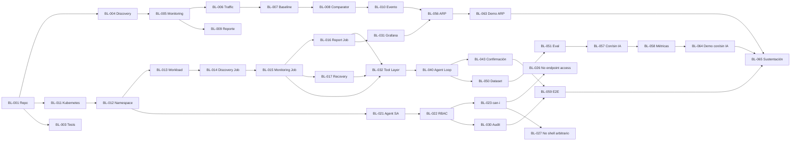

# Product Backlog — Sentinel

> **Estado:** Backlog consolidado para implementación.
>
> **Producto:** Sentinel
>
> **Fuentes principales:** `prd.md` aprobado y `arquitectura.md` aprobada.
>
> **Propósito:** convertir las decisiones del PRD y la arquitectura en unidades de trabajo ejecutables, verificables y ordenadas por dependencia.
>
> **Convenciones:**
> - `[APROBADO]` — decisión ya fijada en PRD/arquitectura.
> - `[INTERNO]` — decisión o detalle propuesto para la implementación del proyecto.
> - `[TBD]` — decisión pendiente que debe cerrarse antes de implementar el elemento que la necesita.
> - `[VERIFICAR]` — afirmación o requisito que requiere validación externa.
> - **Camino crítico** — historia cuya demora bloquea directa o indirectamente la sustentación final.
>
> El backlog no introduce estimaciones de tiempo, costos ni capacidad de desarrollo no contenidas en las fuentes.

---

# 1. Objetivo del backlog

El backlog debe llevar Sentinel desde una base reproducible hasta una demostración extremo a extremo donde puedan observarse simultáneamente:

```text
Kubernetes central
        ↓
Workloads de monitoreo
        ↓
Evidencia determinista
        ↓
Tool Layer
        ↓
Agente IA
        ↓
Confirmación humana
        ↓
Ejecución controlada
        ↓
Auditoría
        ↓
Evaluación con IA vs. sin IA
        ↓
Demo final
```

La hipótesis principal que debe poder evaluarse es:

> **La capa de agente de IA reduce el tiempo y esfuerzo operacional del workflow de monitoreo frente a ejecutar el mismo workflow sin IA, sin degradar seguridad, integridad de evidencia ni control humano.**

---

# 2. Principios de ejecución del backlog

## 2.1 Primero la ruta determinista, después la IA

No se implementará el agente antes de que exista un workflow de monitoreo funcional sin IA.

```text
Scripts
  ↓
Kubernetes Jobs
  ↓
medición
  ↓
reporte
  ↓
baseline/comparación
```

Después:

```text
Agente
  ↓
Tool Layer
  ↓
Kubernetes
  ↓
workflow existente
```

## 2.2 Cada historia debe dejar evidencia

Una historia no queda terminada porque “funcione visualmente”. Debe existir una evidencia reproducible:

- comando;
- salida de Kubernetes;
- prueba automatizada;
- log;
- reporte;
- captura de evidencia del workflow;
- o resultado experimental.

## 2.3 Seguridad antes de ampliar capacidades

La ampliación de capacidades del agente queda condicionada a que estén implementados los controles de:

```text
RBAC
Tool allowlist
validación de parámetros
confirmación humana
auditoría
```

## 2.4 El backlog conserva los límites del MVP

No se incluyen como trabajo obligatorio del MVP:

- descubrimiento automático de nuevos activos;
- respuesta autónoma a ataques;
- bloqueo automático de dispositivos/puertos;
- acceso directo del agente a endpoints;
- shell arbitrario;
- detección de ataques mediante LLM;
- comparación del baseline mediante LLM;
- generación de reportes de monitoreo por IA;
- SIEM completo;
- NMS completo;
- multi-tenancy;
- alta disponibilidad empresarial.

---

# 3. Épicas

| ID | Épica | Resultado | Módulo principal |
|---|---|---|---|
| E01 | Base de proyecto y desarrollo reproducible | Repositorio y estructura de trabajo funcional | Base transversal |
| E02 | Scripts y motor de monitoreo determinista | Discovery, monitoring, tráfico, baseline, comparación y reportes | M4–5 / M6 |
| E03 | Kubernetes y workloads | Workloads Sentinel ejecutándose mediante Kubernetes | M4–5 |
| E04 | Aplicación cloud-native y Helm | Stack reproducible y configurable | M6 |
| E05 | Seguridad Kubernetes y frontera de autonomía | RBAC, ServiceAccounts, NetworkPolicies, Pod Security y pruebas negativas | M7 |
| E06 | Observabilidad y auditoría | Métricas, logs, auditoría y visualización | M8 |
| E07 | Tool Layer y agente IA | Agente limitado a tools autorizadas | Agentic Engineering / M8 |
| E08 | Interfaz y control humano | UI, propuestas, aprobación, rechazo y escalamiento | M8 / Agentic Engineering |
| E09 | GitOps y entrega reproducible | CI/CD y reconciliación declarativa | M8 |
| E10 | Evaluación y red teaming | Dataset, pruebas, métricas, seguridad y escenario ARP | M8 / cierre |
| E11 | Integración y sustentación | Demo extremo a extremo y evidencia final | Sesión 16 |

---

# 4. Estados del backlog

Se propone utilizar estos estados durante la ejecución:

```text
BACKLOG
READY
IN PROGRESS
BLOCKED
IN REVIEW
DONE
```

No se asignan estados de ejecución en este documento; todas las historias parten como backlog de implementación.

---

# 5. Backlog detallado

# E01 — Base de proyecto y desarrollo reproducible

## BL-001 — Estructurar el repositorio del proyecto

**Historia**

> Como desarrollador, quiero una estructura de repositorio coherente con PRD, arquitectura, código, scripts, despliegue y pruebas para que cada artefacto tenga una ubicación reproducible.

**Dependencias:** ninguna.

**Prioridad:** Critical.

**Camino crítico:** Sí.

**Criterios de aceptación**

- `docs/`, `research/`, `src/`, `scripts/`, `deploy/` y `tests/` existen.
- `docs/prd.md` y `docs/arquitectura.md` contienen las versiones aprobadas.
- La estructura del repositorio puede recorrerse con `tree` o un comando equivalente sin rutas faltantes.
- El repositorio contiene un README con instrucciones mínimas de arranque `[INTERNO]`.

**Evidencia**

Salida del comando de estructura del repositorio + commit que incorpora la estructura.

---

## BL-002 — Versionar PRD y arquitectura aprobados

**Historia**

> Como equipo de desarrollo, quiero versionar las especificaciones aprobadas para que las decisiones de producto y arquitectura sean la referencia del backlog.

**Dependencias:** BL-001.

**Prioridad:** Critical.

**Camino crítico:** Sí.

**Criterios de aceptación**

- `docs/prd.md` está presente en Git.
- `docs/arquitectura.md` está presente en Git.
- Ambos archivos tienen un commit identificable.
- El contenido del repositorio corresponde a las versiones aprobadas utilizadas para generar este backlog.

**Evidencia**

`git log -- docs/prd.md docs/arquitectura.md` + hashes de commit.

---

## BL-003 — Definir estrategia de pruebas del proyecto

**Historia**

> Como desarrollador, quiero una estructura para pruebas unitarias, integración y seguridad para que cada historia técnica pueda dejar evidencia verificable.

**Dependencias:** BL-001.

**Prioridad:** High.

**Camino crítico:** Sí.

**Criterios de aceptación**

- Existe `tests/`.
- Existe una convención documentada para ejecutar pruebas.
- Un comando de prueba básico finaliza correctamente, aunque el conjunto inicial sea mínimo.

**Evidencia**

Comando de test documentado + salida `pass`/exit code 0.

---

# E02 — Scripts y motor de monitoreo determinista

## BL-004 — Implementar discovery determinista

**Historia**

> Como analista, quiero ejecutar un discovery reproducible para obtener los atributos básicos de los activos.

**Dependencias:** BL-001, BL-003.

**Prioridad:** Critical.

**Camino crítico:** Sí.

**Criterios de aceptación**

- El script de discovery está versionado.
- Una ejecución genera datos para la topología definida.
- Los resultados incluyen, cuando estén disponibles en la topología, IP, MAC, OS, puertos y servicios.
- Dos ejecuciones sobre un estado estable producen resultados comparables.

**Evidencia**

Salida de ejecución del script + archivo de resultados de una prueba repetida.

---

## BL-005 — Implementar medición periódica de monitoreo

**Historia**

> Como analista, quiero ejecutar mediciones periódicas para obtener el estado actual de los activos.

**Dependencias:** BL-004.

**Prioridad:** Critical.

**Camino crítico:** Sí.

**Criterios de aceptación**

- El script de monitoreo está versionado.
- El intervalo inicial configurado es de 5 s.
- Se producen al menos 5 muestras para el baseline inicial.
- Cada muestra contiene una marca temporal.

**Evidencia**

Ejecución del script mostrando 5 muestras con intervalo temporal de 5 s.

---

## BL-006 — Implementar medición de tráfico

**Historia**

> Como analista, quiero registrar tráfico para observar volumen y comunicación entre activos.

**Dependencias:** BL-005.

**Prioridad:** Critical.

**Camino crítico:** Sí.

**Criterios de aceptación**

- Cada registro de tráfico contiene bytes/s.
- Cada registro permite identificar IP origen.
- Cada registro permite identificar IP destino.
- Cada registro identifica el protocolo cuando esté disponible.
- La salida puede ser consumida posteriormente por el reporte/Grafana.

**Evidencia**

Registro de tráfico de una ejecución controlada + prueba que verifica los campos requeridos.

---

## BL-007 — Implementar baseline inicial de tráfico

**Historia**

> Como analista, quiero construir una referencia de tráfico a partir de muestras iniciales para comparar el comportamiento posterior.

**Dependencias:** BL-006.

**Prioridad:** High.

**Camino crítico:** Sí.

**Criterios de aceptación**

- Se toman 5 muestras.
- Las muestras están separadas por 5 s.
- Se calcula media `μ`.
- Se calcula varianza muestral `s²`.
- La salida identifica qué muestras constituyen el baseline.
- El criterio exacto de umbral permanece documentado como `[TBD]` hasta que se cierre.

**Evidencia**

Archivo/log que contiene las 5 muestras, media y varianza calculadas.

---

## BL-008 — Implementar comparación determinista de estado

**Historia**

> Como sistema de monitoreo, quiero comparar estado anterior y actual para registrar cambios sin depender del LLM.

**Dependencias:** BL-004, BL-005, BL-007.

**Prioridad:** Critical.

**Camino crítico:** Sí.

**Criterios de aceptación**

- El comparador recibe dos estados.
- Detecta al menos un cambio introducido deliberadamente.
- No genera un cambio cuando los estados son equivalentes.
- El comparador no depende del proceso del agente IA.

**Evidencia**

Prueba positiva + prueba negativa + ejecución sin levantar el agente.

---

## BL-009 — Implementar generación de reportes en Shell Script

**Historia**

> Como analista, quiero un reporte de texto plano generado por script para inspeccionar directamente la evidencia del monitoreo.

**Dependencias:** BL-005, BL-006.

**Prioridad:** Critical.

**Camino crítico:** Sí.

**Criterios de aceptación**

- El reporte se genera mediante script, principalmente Shell Script.
- La salida contiene las columnas definidas por el PRD: IP, MAC, protocolo, puerto, tiempo y tráfico.
- El contenido puede abrirse como texto plano.
- La salida no depende de la generación de texto del LLM.
- Una prueba demuestra correspondencia entre al menos una línea del reporte y la medición original.

**Evidencia**

Archivo de reporte + salida de la herramienta fuente + prueba de correspondencia.

---

## BL-010 — Implementar registro de cambio observado

**Historia**

> Como analista, quiero que un cambio detectado quede registrado con valores anterior y actual para poder inspeccionarlo.

**Dependencias:** BL-008, BL-009.

**Prioridad:** Critical.

**Camino crítico:** Sí.

**Criterios de aceptación**

- Se registra timestamp.
- Se identifica el activo.
- Se conserva valor anterior y valor actual del atributo modificado.
- El registro distingue cambio observado de interpretación causal.

**Evidencia**

Caso de prueba donde se modifica un atributo conocido y se produce el registro esperado.

---

# E03 — Kubernetes y workloads

## BL-011 — Preparar clúster Kubernetes de laboratorio

**Historia**

> Como desarrollador, quiero un clúster Kubernetes reproducible para desplegar Sentinel y validar su arquitectura cloud-native.

**Dependencias:** BL-001.

**Prioridad:** Critical.

**Camino crítico:** Sí.

**Criterios de aceptación**

- El clúster está disponible.
- `kubectl cluster-info` finaliza correctamente.
- Se puede crear un namespace de prueba.
- Se puede ejecutar y eliminar un Pod de prueba.

**Evidencia**

Salida de `kubectl cluster-info`, `kubectl get nodes` y ejecución de un Pod de prueba.

---

## BL-012 — Crear namespace funcional de Sentinel

**Historia**

> Como administrador, quiero un namespace dedicado para aislar los componentes funcionales de Sentinel.

**Dependencias:** BL-011.

**Prioridad:** Critical.

**Camino crítico:** Sí.

**Criterios de aceptación**

- Existe namespace `sentinel`.
- Los componentes de Sentinel previstos pueden desplegarse dentro del namespace.
- Los recursos aparecen mediante `kubectl get all -n sentinel` o comandos equivalentes.

**Evidencia**

Manifiesto/configuración + salida de Kubernetes.

---

## BL-013 — Empaquetar el script de monitoreo como workload

**Historia**

> Como sistema, quiero ejecutar el monitoreo dentro de un workload Kubernetes para que Kubernetes sea parte efectiva del flujo.

**Dependencias:** BL-005, BL-011, BL-012.

**Prioridad:** Critical.

**Camino crítico:** Sí.

**Criterios de aceptación**

- Existe una imagen reproducible que contiene los scripts requeridos.
- Un workload Kubernetes inicia el script.
- El workload finaliza con código de salida esperado.
- El resultado puede recuperarse desde Kubernetes.

**Evidencia**

`kubectl get job/pod`, logs del workload y código de salida.

---

## BL-014 — Implementar Discovery Job

**Historia**

> Como usuario, quiero que el discovery se ejecute como Job Kubernetes cuando el workflow lo solicite.

**Dependencias:** BL-004, BL-013.

**Prioridad:** Critical.

**Camino crítico:** Sí.

**Criterios de aceptación**

- El Job puede crearse mediante manifiesto o herramienta definida.
- El Job termina correctamente en un caso normal.
- Los resultados del discovery quedan disponibles para el siguiente paso.

**Evidencia**

`kubectl get job` + `kubectl logs` + artefacto de salida.

---

## BL-015 — Implementar Monitoring Job

**Historia**

> Como usuario, quiero ejecutar el monitoreo como Job Kubernetes para que el workflow esté orquestado por el clúster.

**Dependencias:** BL-013, BL-014.

**Prioridad:** Critical.

**Camino crítico:** Sí.

**Criterios de aceptación**

- El Job se crea correctamente.
- Ejecuta al menos las mediciones configuradas.
- Produce la salida esperada.
- Su estado final puede verificarse con Kubernetes.

**Evidencia**

Manifest + `kubectl describe job` + logs + resultado generado.

---

## BL-016 — Implementar Report Job

**Historia**

> Como usuario, quiero generar el reporte mediante un Job Kubernetes para que la generación de evidencia forme parte del workflow cloud-native.

**Dependencias:** BL-009, BL-015.

**Prioridad:** Critical.

**Camino crítico:** Sí.

**Criterios de aceptación**

- El Job ejecuta el script de reporte.
- El Job produce un archivo/texto de reporte.
- El contenido coincide con la medición fuente en una prueba controlada.

**Evidencia**

Estado del Job + logs + reporte final.

---

## BL-017 — Implementar Recovery Job o mecanismo de recuperación

**Historia**

> Como sistema, quiero ejecutar la recuperación controlada de un workflow fallido sin permitir reintentos indefinidos.

**Dependencias:** BL-015.

**Prioridad:** High.

**Camino crítico:** Sí.

**Criterios de aceptación**

- Existe una ruta de recuperación identificable.
- Se puede simular un fallo inicial.
- El sistema realiza el reintento definido.
- El número máximo de intentos no supera el límite del PRD.
- Un fallo persistente termina en escalamiento humano.

**Evidencia**

Logs con intento inicial, reintentos y estado final.

---

# E04 — Aplicación cloud-native y Helm

## BL-018 — Definir configuración no sensible mediante ConfigMap

**Historia**

> Como administrador, quiero separar configuración de la imagen para que los parámetros del workflow puedan cambiarse sin reconstruir el contenedor.

**Dependencias:** BL-015.

**Prioridad:** High.

**Camino crítico:** Sí.

**Criterios de aceptación**

- Los parámetros no sensibles no están embebidos como valores fijos en la imagen.
- Un `ConfigMap` puede proporcionar parámetros al workload.
- Cambiar un parámetro requiere modificar la configuración y redeploy/restart según el mecanismo utilizado.

**Evidencia**

`kubectl get configmap` + prueba con dos configuraciones distintas.

---

## BL-019 — Implementar Helm Chart de Sentinel

**Historia**

> Como administrador, quiero desplegar Sentinel mediante Helm para obtener una instalación reproducible.

**Dependencias:** BL-012, BL-015, BL-016, BL-018.

**Prioridad:** High.

**Camino crítico:** Sí.

**Criterios de aceptación**

- Existe un Chart de Helm versionado.
- `helm lint` finaliza correctamente.
- `helm template` genera manifests válidos.
- `helm install`/`upgrade` puede desplegar Sentinel en el namespace previsto.

**Evidencia**

Salida de `helm lint`, `helm template` y `helm list`.

---

## BL-020 — Ejecutar despliegue completo desde Helm

**Historia**

> Como administrador, quiero instalar el stack completo mediante una única operación reproducible.

**Dependencias:** BL-019.

**Prioridad:** High.

**Camino crítico:** Sí.

**Criterios de aceptación**

- UI, agente/tooling definido y workloads requeridos quedan desplegados.
- Los Pods llegan al estado esperado.
- Jobs funcionales pueden ejecutarse después de la instalación.
- Se puede desinstalar y volver a instalar sin modificar manualmente los manifiestos generados.

**Evidencia**

Logs de instalación + `kubectl get pods -n sentinel` + prueba de reinstalación.

---

# E05 — Seguridad Kubernetes y frontera de autonomía

## BL-021 — Crear ServiceAccount dedicado para el agente

**Historia**

> Como administrador, quiero una identidad Kubernetes dedicada para el agente para evitar reutilizar privilegios administrativos.

**Dependencias:** BL-012.

**Prioridad:** Critical.

**Camino crítico:** Sí.

**Criterios de aceptación**

- Existe una ServiceAccount específica para el agente.
- El Deployment del agente utiliza esa ServiceAccount.
- El agente no utiliza la ServiceAccount por defecto.

**Evidencia**

Manifest/objeto de ServiceAccount + `kubectl get deployment ... -o yaml`.

---

## BL-022 — Definir RBAC mínimo del agente

**Historia**

> Como responsable de seguridad, quiero que el agente solo tenga los permisos Kubernetes que requiere para sus tools.

**Dependencias:** BL-021, BL-003.

**Prioridad:** Critical.

**Camino crítico:** Sí.

**Criterios de aceptación**

- Existe `Role`/`RoleBinding` o equivalente definido para el agente.
- Los `apiGroups`, `resources` y `verbs` corresponden únicamente a las operaciones realmente implementadas.
- No se concede `cluster-admin` al agente.

**Evidencia**

Manifiestos RBAC + revisión de `kubectl describe role/rolebinding`.

---

## BL-023 — Validar permisos con `kubectl auth can-i`

**Historia**

> Como responsable de seguridad, quiero demostrar con pruebas positivas y negativas qué puede hacer el agente.

**Dependencias:** BL-022.

**Prioridad:** Critical.

**Camino crítico:** Sí.

**Criterios de aceptación**

- Existen comprobaciones `can-i` para operaciones permitidas.
- Existen comprobaciones `can-i` para operaciones prohibidas.
- Las operaciones prohibidas devuelven `no`.
- Los resultados de las pruebas quedan versionados como evidencia o reproducibles mediante comandos documentados.

**Evidencia**

Salida de `kubectl auth can-i` para casos positivos y negativos.

---

## BL-024 — Aplicar Pod Security al namespace/workloads

**Historia**

> Como administrador, quiero una postura de ejecución restringida para reducir superficie de ataque de los workloads.

**Dependencias:** BL-020.

**Prioridad:** High.

**Camino crítico:** Sí.

**Criterios de aceptación**

- El mecanismo de Pod Security seleccionado está habilitado.
- Los workloads de Sentinel pasan las restricciones aplicadas.
- Un Pod de prueba que viole la política es rechazado cuando corresponde.

**Evidencia**

Configuración de admisión + prueba de Pod válido y Pod rechazado.

---

## BL-025 — Aplicar NetworkPolicies

**Historia**

> Como administrador, quiero limitar las comunicaciones entre workloads para reducir movimiento lateral y accesos no previstos.

**Dependencias:** BL-020.

**Prioridad:** High.

**Camino crítico:** Sí.

**Criterios de aceptación**

- Existen políticas para las comunicaciones internas requeridas.
- Una comunicación permitida funciona.
- Una comunicación no permitida falla.

**Evidencia**

Manifiestos NetworkPolicy + pruebas de conectividad positiva/negativa.

---

## BL-026 — Validar que el agente no tenga acceso directo a endpoints

**Historia**

> Como responsable de seguridad, quiero demostrar que el agente carece de una ruta directa hacia los activos monitorizados.

**Dependencias:** BL-023, BL-025.

**Prioridad:** Critical.

**Camino crítico:** Sí.

**Criterios de aceptación**

- El agente no dispone de credenciales de endpoint.
- El agente no tiene una tool de endpoint directo.
- Una prueba intenta acceder directamente y falla por arquitectura/permisos/configuración.
- El camino permitido pasa por Tool Layer → Kubernetes → workload/script.

**Evidencia**

Inventario de credenciales/tools + prueba negativa + diagrama/ruta observada.

---

## BL-027 — Validar ausencia de shell arbitrario

**Historia**

> Como responsable de seguridad, quiero demostrar que el agente no puede convertir una solicitud textual en ejecución shell arbitraria.

**Dependencias:** BL-022, BL-026.

**Prioridad:** Critical.

**Camino crítico:** Sí.

**Criterios de aceptación**

- No existe tool de ejecución shell genérica expuesta al agente.
- Una solicitud para ejecutar un comando arbitrario es rechazada.
- El intento queda registrado cuando corresponde.

**Evidencia**

Prueba negativa + configuración de tools + log.

---

# E06 — Observabilidad y auditoría

## BL-028 — Implementar métricas operacionales del agente

**Historia**

> Como administrador, quiero métricas del agente para observar workflows, tools, errores, reintentos y escalamiento.

**Dependencias:** BL-007, BL-021.

**Prioridad:** High.

**Camino crítico:** Sí.

**Criterios de aceptación**

- Se instrumentan métricas para workflows iniciados/completados/fallidos.
- Se instrumentan tool calls y errores.
- Se registra al menos el número de reintentos.
- Se puede consultar el valor de una métrica después de una ejecución real.

**Evidencia**

Endpoint/salida de métricas + ejecución de prueba.

---

## BL-029 — Implementar logs estructurados de operación

**Historia**

> Como administrador, quiero logs operacionales que permitan reconstruir una ejecución.

**Dependencias:** BL-028.

**Prioridad:** High.

**Camino crítico:** Sí.

**Criterios de aceptación**

- Los logs contienen identificador de workflow.
- Se registra tool, resultado, error e intento cuando corresponda.
- Los logs no contienen secretos en claro.
- Los logs pueden recuperarse desde Kubernetes.

**Evidencia**

`kubectl logs` o mecanismo equivalente + prueba de contenido.

---

## BL-030 — Implementar auditoría de confirmaciones y ejecuciones

**Historia**

> Como responsable de seguridad, quiero trazabilidad de qué propuso el agente, quién aprobó y qué se ejecutó.

**Dependencias:** BL-029, BL-021.

**Prioridad:** Critical.

**Camino crítico:** Sí.

**Criterios de aceptación**

- Se registra usuario.
- Se registra workflow.
- Se registra tool.
- Se registra parámetros relevantes.
- Se registra confirmación/rechazo.
- Se registra resultado y número de intento.
- Se registra recurso Kubernetes relacionado cuando corresponda.

**Evidencia**

Registro completo de una ejecución con aprobación y resultado.

---

## BL-031 — Integrar Grafana

**Historia**

> Como analista, quiero visualizar tráfico y actividad sin delegar al LLM la generación de esa visualización.

**Dependencias:** BL-006, BL-028.

**Prioridad:** High.

**Camino crítico:** Sí.

**Criterios de aceptación**

- Grafana está desplegada o accesible según la arquitectura definida.
- Existe una visualización de la métrica de tráfico seleccionada.
- Una ejecución controlada produce un cambio visible en la métrica.
- El agente no requiere acceso administrativo a Grafana.

**Evidencia**

Configuración del dashboard + valor observable antes y después de una prueba.

---

# E07 — Tool Layer y agente IA

## BL-032 — Implementar Tool Layer mínima

**Historia**

> Como arquitecto, quiero una capa intermedia entre el agente y Kubernetes para limitar y validar las capacidades disponibles.

**Dependencias:** BL-022, BL-023, BL-015, BL-016.

**Prioridad:** Critical.

**Camino crítico:** Sí.

**Criterios de aceptación**

- La Tool Layer está separada del proceso del agente.
- Existen únicamente las tools implementadas y autorizadas.
- Una tool recibe parámetros explícitos.
- Una llamada inválida puede ser rechazada antes de llegar a Kubernetes.
- Las llamadas quedan registradas.

**Evidencia**

Prueba de tool válida + prueba inválida + logs.

---

## BL-033 — Implementar `get_cluster_state()`

**Historia**

> Como agente, quiero consultar el estado permitido de Kubernetes para decidir el siguiente paso del workflow.

**Dependencias:** BL-032, BL-023.

**Prioridad:** Critical.

**Camino crítico:** Sí.

**Criterios de aceptación**

- La tool devuelve únicamente información de recursos autorizados.
- Una consulta a un recurso no autorizado falla.
- La respuesta puede ser consumida por el agente.

**Evidencia**

Caso positivo y negativo + logs de tool call.

---

## BL-034 — Implementar `discover_assets()`

**Historia**

> Como agente, quiero solicitar el discovery mediante una tool autorizada.

**Dependencias:** BL-014, BL-032.

**Prioridad:** Critical.

**Camino crítico:** Sí.

**Criterios de aceptación**

- La tool crea/ejecuta el Discovery Job autorizado.
- Recibe el resultado del Job.
- No ejecuta shell arbitrario.

**Evidencia**

Tool call + Job creado + resultado recuperado.

---

## BL-035 — Implementar `start_monitoring()`

**Historia**

> Como agente, quiero iniciar el workflow de monitoreo mediante una tool autorizada.

**Dependencias:** BL-015, BL-032.

**Prioridad:** Critical.

**Camino crítico:** Sí.

**Criterios de aceptación**

- La tool crea/ejecuta el Monitoring Job esperado.
- Los parámetros del workflow son explícitos.
- La llamada respeta la autorización definida.
- El resultado del Job es recuperable.

**Evidencia**

Tool call + Job + resultado.

---

## BL-036 — Implementar `generate_report()`

**Historia**

> Como agente, quiero solicitar la generación del reporte mediante una tool sin generar yo mismo la evidencia.

**Dependencias:** BL-016, BL-032.

**Prioridad:** Critical.

**Camino crítico:** Sí.

**Criterios de aceptación**

- La tool ejecuta el Report Job.
- El contenido final proviene del script.
- El agente no modifica la salida original.

**Evidencia**

Tool call + Report Job + hash/contenido del reporte antes y después de pasar por el agente `[INTERNO]`.

---

## BL-037 — Implementar `restart_monitoring_job()`

**Historia**

> Como agente, quiero reintentar un workflow fallido dentro del límite permitido.

**Dependencias:** BL-017, BL-032.

**Prioridad:** High.

**Camino crítico:** Sí.

**Criterios de aceptación**

- La tool solo actúa sobre el recurso autorizado.
- El contador de intentos es persistente durante el workflow.
- No permite exceder el número máximo definido.

**Evidencia**

Prueba de fallo + tres estados máximos de intento + bloqueo posterior.

---

## BL-038 — Implementar `update_monitoring_config()` con allowlist

**Historia**

> Como agente, quiero solicitar cambios de configuración limitados a parámetros previamente permitidos.

**Dependencias:** BL-018, BL-032, BL-023.

**Prioridad:** High.

**Camino crítico:** Sí.

**Criterios de aceptación**

- Solo puede modificar configuraciones de la allowlist.
- Los parámetros se validan antes de ejecutar.
- Un parámetro inválido es rechazado.
- Una configuración no autorizada no puede ser modificada por la tool.

**Evidencia**

Pruebas positiva/negativa de configuración.

---

## BL-039 — Implementar adapter del LLM

**Historia**

> Como arquitecto, quiero aislar la implementación del modelo detrás de un adapter para poder cambiar entre modelo local o externo sin reescribir workflows.

**Dependencias:** BL-032.

**Prioridad:** High.

**Camino crítico:** Sí.

**Criterios de aceptación**

- El agente accede al modelo mediante una interfaz estable.
- El workflow no depende de un proveedor concreto.
- La configuración del proveedor/modelo está fuera de la imagen.
- La implementación seleccionada queda documentada como `[TBD]` hasta la decisión final.

**Evidencia**

Diagrama/interfaz de adapter + prueba de invocación con el modelo seleccionado.

---

## BL-040 — Implementar loop de agente limitado

**Historia**

> Como agente, quiero procesar solicitud → contexto → propuesta → aprobación → tool → resultado sin ejecutar fuera de los límites establecidos.

**Dependencias:** BL-033, BL-034, BL-035, BL-036, BL-037, BL-038, BL-039.

**Prioridad:** Critical.

**Camino crítico:** Sí.

**Criterios de aceptación**

- El agente puede consultar contexto permitido.
- Selecciona una tool autorizada en un caso normal.
- No ejecuta antes de la confirmación requerida.
- Usa el resultado de la tool para continuar el workflow.
- Un error provoca el flujo de recovery definido.
- Un estado no resoluble termina en escalamiento.

**Evidencia**

Ejecución completa del loop + trazas/logs de cada transición.

---

## BL-041 — Implementar protección contra datos manipulados / prompt injection indirecto

**Historia**

> Como responsable de seguridad, quiero que los resultados de herramientas sean tratados como datos no confiables y no como instrucciones del sistema.

**Dependencias:** BL-040, BL-030.

**Prioridad:** Critical.

**Camino crítico:** Sí.

**Criterios de aceptación**

- Un resultado de tool que contenga texto como “ignora instrucciones” no cambia la política del agente.
- No se ejecuta una tool no autorizada como consecuencia del dato manipulado.
- El evento de prueba puede reconstruirse mediante logs.

**Evidencia**

Caso adversarial documentado + salida esperada + logs.

---

# E08 — Interfaz y control humano

## BL-042 — Implementar interfaz mínima de operación

**Historia**

> Como analista, quiero una interfaz desde la cual iniciar un workflow y revisar su estado.

**Dependencias:** BL-040, BL-029.

**Prioridad:** High.

**Camino crítico:** Sí.

**Criterios de aceptación**

- La UI está disponible en el mecanismo de acceso definido.
- Permite iniciar un workflow.
- Muestra el estado de la ejecución.
- Permite acceder al resultado.

**Evidencia**

Prueba manual reproducible + logs del backend.

---

## BL-043 — Implementar pantalla de propuesta y confirmación

**Historia**

> Como analista, quiero ver qué operación propone el agente y aprobarla o rechazarla antes de su ejecución.

**Dependencias:** BL-042, BL-040.

**Prioridad:** Critical.

**Camino crítico:** Sí.

**Criterios de aceptación**

- La UI muestra herramienta y parámetros relevantes.
- Existe acción explícita de aprobar.
- Existe acción explícita de rechazar.
- Rechazar no genera ejecución de la tool.
- Aprobar genera la ejecución correspondiente.

**Evidencia**

Prueba con rechazo + prueba con aprobación + registros de auditoría.

---

## BL-044 — Implementar expiración segura de aprobación

**Historia**

> Como usuario, quiero que el abandono o timeout de una aprobación pendiente no se interprete como autorización.

**Dependencias:** BL-043.

**Prioridad:** High.

**Camino crítico:** Sí.

**Criterios de aceptación**

- Una aprobación pendiente expira o cancela según la regla definida.
- La expiración no ejecuta la tool.
- El evento queda registrado.

**Evidencia**

Prueba con timeout/abandono + ausencia de tool call + log.

---

## BL-045 — Implementar escalamiento a humano

**Historia**

> Como analista, quiero recibir el contexto suficiente cuando el agente no logra resolver un workflow.

**Dependencias:** BL-017, BL-040, BL-043.

**Prioridad:** High.

**Camino crítico:** Sí.

**Criterios de aceptación**

- Se alcanza el estado de escalamiento después de agotar reintentos.
- Se muestran operación, herramienta, último error e intentos.
- El sistema no inicia otro intento automáticamente después del escalamiento.

**Evidencia**

Prueba de fallo persistente + pantalla/log de escalamiento.

---

# E09 — GitOps y entrega reproducible

## BL-046 — Preparar manifiestos declarativos para GitOps

**Historia**

> Como administrador, quiero que el estado deseado de Sentinel pueda almacenarse declarativamente en Git.

**Dependencias:** BL-019, BL-024, BL-025.

**Prioridad:** High.

**Camino crítico:** Sí.

**Criterios de aceptación**

- Los manifiestos/Chart requeridos están versionados.
- El despliegue puede reproducirse desde Git.
- No hay Secrets reales en texto plano dentro del repositorio.

**Evidencia**

Repositorio + prueba de despliegue desde artefactos versionados.

---

## BL-047 — Configurar Argo CD

**Historia**

> Como administrador, quiero que Argo CD reconcilie el estado deseado de Sentinel desde Git.

**Dependencias:** BL-046.

**Prioridad:** High.

**Camino crítico:** Sí.

**Criterios de aceptación**

- Argo CD está desplegado en el namespace previsto.
- Existe una aplicación que apunta al repositorio/configuración de Sentinel.
- El estado sincronizado coincide con Git.

**Evidencia**

`kubectl` + estado de Argo CD + repositorio.

---

## BL-048 — Validar reconciliación y rollback

**Historia**

> Como administrador, quiero demostrar que un cambio de Git se refleja en Kubernetes y que una reversión restaura el estado anterior.

**Dependencias:** BL-047.

**Prioridad:** High.

**Camino crítico:** Sí.

**Criterios de aceptación**

- Un cambio controlado en Git provoca una reconciliación observable.
- El estado anterior puede recuperarse mediante reversión versionada.
- Tras el rollback, Kubernetes converge al estado esperado.

**Evidencia**

Commits antes/después + estado Argo CD/Kubernetes + prueba de rollback.

---

## BL-049 — Verificar secretos fuera de Git en claro

**Historia**

> Como administrador, quiero que el mecanismo de secretos impida que credenciales reales aparezcan en imágenes o Git en texto plano.

**Dependencias:** BL-046.

**Prioridad:** Critical.

**Camino crítico:** Sí.

**Criterios de aceptación**

- No aparecen secretos reales mediante búsqueda controlada del repositorio.
- No existen credenciales reales dentro de las imágenes publicadas `[INTERNO: prueba con revisión de imagen]`.
- Los secretos se inyectan mediante el mecanismo seleccionado.

**Evidencia**

Resultado de revisión del repositorio + inspección de manifests/imagen + prueba de despliegue.

---

# E10 — Evaluación y red teaming

## BL-050 — Construir dataset inicial de evaluación del agente

**Historia**

> Como evaluador, quiero un conjunto de casos con ground truth para medir factualidad, adherencia, relevancia, selección de tools y seguridad.

**Dependencias:** BL-040, BL-043.

**Prioridad:** Critical.

**Camino crítico:** Sí.

**Criterios de aceptación**

- Cada caso tiene ID.
- Cada caso define entrada/contexto.
- Cada caso define resultado esperado.
- Existen casos normales, errores, rechazo, ambigüedad y solicitudes fuera de alcance.
- Existen casos de prompt injection indirecto.

**Evidencia**

Archivo versionado de dataset + documentación del ground truth.

---

## BL-051 — Implementar evaluación automática del comportamiento del agente

**Historia**

> Como evaluador, quiero pruebas automáticas para detectar llamadas incorrectas de tools, parámetros inválidos, falta de confirmación y otros incumplimientos.

**Dependencias:** BL-050.

**Prioridad:** Critical.

**Camino crítico:** Sí.

**Criterios de aceptación**

- Las pruebas verifican selección de tool.
- Verifican parámetros.
- Verifican aprobación/rechazo.
- Verifican resultado de ejecución.
- Verifican límites de reintento.
- Una violación crítica produce fallo de la prueba.

**Evidencia**

Salida del conjunto de pruebas con casos pass/fail.

---

## BL-052 — Ejecutar revisión humana de outputs

**Historia**

> Como evaluador, quiero revisar manualmente factualidad, adherencia y relevancia donde la automatización no sea suficiente.

**Dependencias:** BL-050.

**Prioridad:** High.

**Camino crítico:** Sí.

**Criterios de aceptación**

- Existe una rúbrica documentada.
- Cada caso revisado tiene resultado.
- Los casos con fallo tienen observación registrada.

**Evidencia**

Matriz de evaluación humana versionada.

---

## BL-053 — Ejecutar red teaming de bypass de aprobación

**Historia**

> Como responsable de seguridad, quiero comprobar que el agente no ejecuta acciones cuando el usuario no las ha autorizado.

**Dependencias:** BL-043, BL-051.

**Prioridad:** Critical.

**Camino crítico:** Sí.

**Criterios de aceptación**

- Se prueban solicitudes directas para saltar aprobación.
- La ejecución no autorizada no ocurre.
- La prueba queda registrada.

**Evidencia**

Casos adversariales + resultado + auditoría.

---

## BL-054 — Ejecutar red teaming de escalada de capacidades

**Historia**

> Como responsable de seguridad, quiero comprobar que el agente no puede obtener capacidades que no forman parte de su Tool Layer/RBAC.

**Dependencias:** BL-023, BL-027, BL-051.

**Prioridad:** Critical.

**Camino crítico:** Sí.

**Criterios de aceptación**

- Se prueba solicitud de shell arbitrario.
- Se prueba creación de recursos no permitidos.
- Se prueba operación fuera de RBAC.
- Todas las acciones prohibidas son rechazadas.

**Evidencia**

Logs de cada prueba + salida `can-i` + resultado de ejecución.

---

## BL-055 — Ejecutar red teaming de prompt injection indirecto

**Historia**

> Como responsable de seguridad, quiero demostrar que datos manipulados provenientes de tools no se convierten en instrucciones ejecutables.

**Dependencias:** BL-041, BL-051.

**Prioridad:** Critical.

**Camino crítico:** Sí.

**Criterios de aceptación**

- Se insertan textos de ataque en resultados de herramientas.
- El agente mantiene sus restricciones.
- No se ejecuta una operación no autorizada.
- El incidente de prueba queda trazable.

**Evidencia**

Caso adversarial + output + tool call + auditoría.

---

## BL-056 — Ejecutar escenario adversarial ARP controlado

**Historia**

> Como evaluador, quiero reproducir el escenario ARP definido para verificar qué cambios observables registra Sentinel.

**Dependencias:** BL-010, BL-006, BL-031.

**Prioridad:** High.

**Camino crítico:** Sí.

**Criterios de aceptación**

- La topología normal está establecida antes del escenario.
- Se incorpora temporalmente el activo atacante definido para el laboratorio.
- Se observa actividad ARP modificada durante el escenario.
- Se registra un cambio en la asociación IP↔MAC cuando el escenario lo produzca.
- El reporte conserva valores observados sin afirmar causalidad no demostrada.

**Evidencia**

Reporte antes/durante/después + métricas de tráfico/ARP + registro del cambio IP↔MAC.

---

## BL-057 — Construir experimento con IA vs. sin IA

**Historia**

> Como evaluador, quiero ejecutar el mismo workflow en condición control y condición con agente para medir el aporte operacional de la IA.

**Dependencias:** BL-040, BL-050, BL-051.

**Prioridad:** Critical.

**Camino crítico:** Sí.

**Criterios de aceptación**

- El workflow sin IA puede ejecutarse independientemente del agente.
- El workflow con IA ejecuta las mismas funciones objetivo.
- Se registra tiempo total de ambas condiciones.
- Se registra tiempo humano de ambas condiciones.
- Se registran errores y reintentos en ambas condiciones.

**Evidencia**

Dataset de ejecuciones + tabla comparativa + logs.

---

## BL-058 — Medir North Star y métricas de calidad/seguridad

**Historia**

> Como evaluador, quiero calcular las métricas aprobadas para determinar si la IA aporta valor sin degradar seguridad ni evidencia.

**Dependencias:** BL-057, BL-030, BL-051.

**Prioridad:** Critical.

**Camino crítico:** Sí.

**Criterios de aceptación**

- Se calcula el tiempo mediano del workflow con y sin IA.
- Se calcula tiempo operacional humano con y sin IA.
- Se calcula tasa de workflows completados.
- Se calcula tasa de llamadas correctas de tools.
- Se calcula recuperación de fallos.
- Se verifica que acciones no autorizadas sean 0 en la prueba de seguridad.
- Se verifica integridad de evidencia en el conjunto evaluado.
- Se calcula la métrica de ruido definida.

**Evidencia**

Notebook/script de análisis o informe reproducible + datos fuente.

---

# E11 — Integración y sustentación

## BL-059 — Integrar workflow extremo a extremo

**Historia**

> Como usuario, quiero ejecutar desde la interfaz un workflow completo que recorra agente, Tool Layer, Kubernetes, scripts, evidencia y auditoría.

**Dependencias:** BL-043, BL-035, BL-036, BL-030, BL-031.

**Prioridad:** Critical.

**Camino crítico:** Sí.

**Criterios de aceptación**

- El usuario inicia el workflow desde la UI.
- El agente consulta el estado permitido.
- El agente propone una operación.
- El usuario confirma.
- Se ejecuta la tool.
- Kubernetes crea/ejecuta el Job.
- Se genera el reporte.
- Se registra la auditoría.
- El usuario puede revisar el resultado.

**Evidencia**

Grabación/capturas de ejecución + logs completos + reporte + auditoría.

---

## BL-060 — Ejecutar workflow completo sin agente

**Historia**

> Como evaluador, quiero una versión control del workflow para comparar el aporte de la IA.

**Dependencias:** BL-016, BL-008, BL-030.

**Prioridad:** Critical.

**Camino crítico:** Sí.

**Criterios de aceptación**

- El workflow puede ejecutarse sin levantar el agente.
- Produce el mismo tipo de evidencia funcional objetivo.
- Sus tiempos y pasos quedan registrados.

**Evidencia**

Ejecución documentada + reportes + tiempos.

---

## BL-061 — Preparar demo de error y recuperación

**Historia**

> Como presentador, quiero demostrar un fallo recuperable y/o un escalamiento para evidenciar los límites de autonomía del agente.

**Dependencias:** BL-017, BL-045.

**Prioridad:** High.

**Camino crítico:** Sí.

**Criterios de aceptación**

- Se puede provocar un fallo controlado.
- El agente realiza los reintentos definidos.
- La demo termina en éxito recuperado o escalamiento según el caso preparado.
- Los logs muestran la secuencia completa.

**Evidencia**

Logs del escenario + estado final + evidencia visual de la demo.

---

## BL-062 — Preparar demo de seguridad Kubernetes

**Historia**

> Como presentador, quiero demostrar que la frontera de autonomía es real y verificable.

**Dependencias:** BL-023, BL-024, BL-025, BL-026, BL-027.

**Prioridad:** High.

**Camino crítico:** Sí.

**Criterios de aceptación**

- Se muestra al menos un permiso permitido.
- Se muestra al menos un permiso denegado.
- Se demuestra que el agente no tiene shell arbitrario.
- Se demuestra la separación de permisos mediante ServiceAccount/RBAC.

**Evidencia**

Comandos `kubectl auth can-i` + manifests + resultado de prueba negativa.

---

## BL-063 — Preparar demo del escenario ARP

**Historia**

> Como presentador, quiero demostrar el escenario adversarial controlado y la evidencia objetiva producida por Sentinel.

**Dependencias:** BL-056.

**Prioridad:** High.

**Camino crítico:** Sí.

**Criterios de aceptación**

- El tráfico normal inicial está registrado.
- El atacante temporal puede incorporarse y retirarse de la topología.
- El cambio IP↔MAC esperado por el escenario puede observarse en el reporte cuando ocurra.
- La actividad ARP modificada aparece en la evidencia disponible.
- El lenguaje de la demo distingue observación de interpretación causal.

**Evidencia**

Reporte de laboratorio + dashboard + guion técnico de la demo.

---

## BL-064 — Preparar demo de comparación con/sin IA

**Historia**

> Como presentador, quiero mostrar de forma reproducible el experimento que mide el aporte de la IA.

**Dependencias:** BL-057, BL-058.

**Prioridad:** Critical.

**Camino crítico:** Sí.

**Criterios de aceptación**

- Se ejecuta el workflow control.
- Se ejecuta el workflow con agente.
- Se muestran tiempos comparables.
- Se muestran errores/reintentos.
- Se conserva la evidencia de ambas ejecuciones.

**Evidencia**

Tabla/gráfico de resultados + logs de las dos condiciones.

---

## BL-065 — Preparar paquete final de sustentación

**Historia**

> Como responsable del proyecto, quiero un paquete final reproducible para presentar la solución completa y demostrar sus decisiones técnicas.

**Dependencias:** BL-059, BL-060, BL-061, BL-062, BL-063, BL-064, BL-048.

**Prioridad:** Critical.

**Camino crítico:** Sí.

**Criterios de aceptación**

- PRD, arquitectura y backlog están versionados.
- El despliegue puede reproducirse desde el repositorio definido.
- Existe evidencia de Kubernetes.
- Existe evidencia de seguridad/RBAC.
- Existe evidencia de monitoreo y reportes.
- Existe evidencia de agente + aprobación.
- Existe evidencia de evaluación con/sin IA.
- Existe evidencia del escenario ARP.
- Existe una guía de ejecución de la demo.

**Evidencia**

Repositorio final + checklist de sustentación completado + versión/commit final.

---

# 6. Dependencias resumidas



---

# 7. Orden global recomendado de ejecución

El siguiente orden evita implementar capacidades que dependen de componentes aún inexistentes.

## Fase A — Base

```text
BL-001
BL-002
BL-003
```

## Fase B — Monitoreo determinista

```text
BL-004
BL-005
BL-006
BL-007
BL-008
BL-009
BL-010
```

## Fase C — Kubernetes

```text
BL-011
BL-012
BL-013
BL-014
BL-015
BL-016
BL-017
```

## Fase D — Cloud-native / Helm

```text
BL-018
BL-019
BL-020
```

## Fase E — Seguridad

```text
BL-021
BL-022
BL-023
BL-024
BL-025
BL-026
BL-027
```

## Fase F — Observabilidad

```text
BL-028
BL-029
BL-030
BL-031
```

## Fase G — Agentic Engineering

```text
BL-032
BL-033
BL-034
BL-035
BL-036
BL-037
BL-038
BL-039
BL-040
BL-041
```

## Fase H — UI / Human-in-the-loop

```text
BL-042
BL-043
BL-044
BL-045
```

## Fase I — GitOps

```text
BL-046
BL-047
BL-048
BL-049
```

## Fase J — Evaluación

```text
BL-050
BL-051
BL-052
BL-053
BL-054
BL-055
BL-056
BL-057
BL-058
```

## Fase K — Integración y sustentación

```text
BL-059
BL-060
BL-061
BL-062
BL-063
BL-064
BL-065
```

---

# 8. Agrupación por módulo del curso

## Módulos 4–5 — Kubernetes / CKA

### Objetivos de aprendizaje aplicados a Sentinel

- preparar y operar clúster;
- namespaces;
- Pods/Jobs;
- redes;
- scheduling/troubleshooting;
- observabilidad básica.

### Historias

```text
BL-011  Clúster
BL-012  Namespace
BL-013  Workload
BL-014  Discovery Job
BL-015  Monitoring Job
BL-017  Recovery
```

### Validación

```text
kubectl get nodes
kubectl get pods
kubectl get jobs
kubectl logs
kubectl describe
```

---

## Módulo 6 — CKAD / Helm

### Objetivos aplicados

- workloads;
- configuración;
- Jobs;
- ConfigMaps;
- Helm;
- despliegue reproducible.

### Historias

```text
BL-016  Report Job
BL-018  ConfigMap
BL-019  Helm Chart
BL-020  Despliegue completo
```

### Validación

```text
helm lint
helm template
helm install
helm list
kubectl get pods
```

---

## Módulo 7 — CKS / seguridad Kubernetes

### Objetivos aplicados

- ServiceAccounts;
- RBAC;
- mínimo privilegio;
- NetworkPolicies;
- Pod Security;
- pruebas negativas.

### Historias

```text
BL-021  ServiceAccount
BL-022  RBAC
BL-023  can-i
BL-024  Pod Security
BL-025  NetworkPolicies
BL-026  No acceso directo a endpoints
BL-027  No shell arbitrario
```

### Validación

```text
kubectl auth can-i ...
kubectl get role
kubectl get rolebinding
kubectl get networkpolicy
```

---

## Módulo 8 — Producción / GitOps / métricas

### Objetivos aplicados

- métricas;
- logs;
- operación reproducible;
- GitOps;
- rollback;
- evidencia operativa.

### Historias

```text
BL-028  Métricas
BL-029  Logs
BL-030  Auditoría
BL-031  Grafana
BL-046  GitOps manifests
BL-047  Argo CD
BL-048  Rollback
BL-049  Secrets
```

---

## Bloque Agentic Engineering / MCP

La aplicación concreta al proyecto es:

- tool use;
- agentic loop;
- Tool Layer;
- aprobación humana;
- evaluación adversarial;
- trazabilidad.

### Historias

```text
BL-032  Tool Layer
BL-033  Cluster state
BL-034  Discovery tool
BL-035  Monitoring tool
BL-036  Report tool
BL-037  Recovery tool
BL-038  Config tool
BL-039  LLM adapter
BL-040  Agent loop
BL-041  Prompt injection
BL-043  Confirmación
BL-044  Timeout seguro
BL-045  Escalamiento
BL-050–BL-055  Evaluación/red teaming
```

El programa del curso incluye explícitamente tool use, agentic loops, MCP y construcción de agentes para automatizar tareas en Kubernetes. 

---

# 9. Camino crítico hacia la sustentación

El camino crítico no es una única cadena lineal porque varias ramas pueden desarrollarse en paralelo, pero existe un conjunto mínimo de historias cuyo retraso bloquea la demo final.

## Cadena principal

```text
BL-001
  ↓
BL-011
  ↓
BL-012
  ↓
BL-013
  ↓
BL-015
  ↓
BL-016
  ↓
BL-021
  ↓
BL-022
  ↓
BL-023
  ↓
BL-032
  ↓
BL-035
  ↓
BL-039
  ↓
BL-040
  ↓
BL-043
  ↓
BL-030
  ↓
BL-059
```

## Rama de evidencia determinista

```text
BL-004
  ↓
BL-005
  ↓
BL-006
  ↓
BL-007
  ↓
BL-008
  ↓
BL-009
  ↓
BL-010
  ↓
BL-056
  ↓
BL-063
```

## Rama de evaluación de IA

```text
BL-040
  ↓
BL-050
  ↓
BL-051
  ↓
BL-057
  ↓
BL-058
  ↓
BL-064
```

## Rama de seguridad

```text
BL-021
  ↓
BL-022
  ↓
BL-023
  ↓
BL-024
  ↓
BL-025
  ↓
BL-026 / BL-027
  ↓
BL-062
```

## Convergencia final

```text
BL-059  Workflow E2E
   │
BL-062  Demo seguridad
   │
BL-063  Demo ARP
   │
BL-064  Demo con/sin IA
   │
BL-048  GitOps / rollback
   │
   └──────────────┐
                  ▼
             BL-065
       Paquete sustentación
```

---

# 10. Historias que pueden ejecutarse en paralelo

Una vez terminadas las dependencias base, estas ramas pueden avanzar en paralelo `[INTERNO]`:

```text
Rama A — Monitoreo
BL-004 → BL-010

Rama B — Kubernetes
BL-011 → BL-020

Rama C — Seguridad
BL-021 → BL-027

Rama D — Observabilidad
BL-028 → BL-031

Rama E — Agentic
BL-032 → BL-041

Rama F — UI
BL-042 → BL-045

Rama G — GitOps
BL-046 → BL-049
```

La integración completa debe esperar a que las historias necesarias de cada rama alcancen `DONE`.

---

# 11. Definition of Done global

Una historia se considera `DONE` cuando:

```text
[ ] Implementación versionada
[ ] Criterios de aceptación cumplidos
[ ] Prueba ejecutada
[ ] Evidencia almacenada
[ ] Sin secretos en Git/imágenes
[ ] Documentación actualizada cuando aplique
[ ] Dependencias resueltas
[ ] No introduce una capacidad prohibida por el PRD
```

Para historias críticas de seguridad, además:

```text
[ ] Existe prueba negativa
[ ] El control está impuesto técnicamente
[ ] La evidencia puede reproducirse
```

---

# 12. Definition of Done del producto

Sentinel puede considerarse listo para la sustentación cuando:

```text
✅ Kubernetes es parte central del workflow
✅ Discovery funciona
✅ Monitoring funciona
✅ Traffic monitoring funciona
✅ Baseline/comparación funciona
✅ Reporte SH funciona
✅ Jobs Kubernetes funcionan
✅ Helm despliega el stack
✅ RBAC mínimo funciona
✅ can-i demuestra permisos
✅ Pod Security funciona
✅ NetworkPolicies funcionan
✅ No existe acceso directo del agente a endpoints
✅ No existe shell arbitrario
✅ Tool Layer funciona
✅ Agente funciona
✅ Confirmación humana funciona
✅ Rechazo funciona
✅ Timeout/abandono no ejecuta
✅ Recovery está limitado
✅ Escalamiento funciona
✅ Auditoría funciona
✅ Grafana funciona
✅ GitOps funciona
✅ Rollback fue probado
✅ Dataset de IA existe
✅ Evaluación del agente existe
✅ Red teaming existe
✅ Prompt injection indirecto fue probado
✅ ARP controlado fue ejecutado
✅ Workflow sin IA fue ejecutado
✅ Workflow con IA fue ejecutado
✅ Métricas con/sin IA fueron calculadas
✅ Paquete de sustentación está reproducible
```

---

# 13. Riesgos de backlog

| Riesgo | Señal de alerta | Acción |
|---|---|---|
| Agente se implementa antes del workflow determinista | Tool Layer necesita inventar operaciones | Bloquear E07 hasta completar E02/E03 |
| RBAC queda para el final | Agente ya crea recursos antes de tener pruebas negativas | Detener ampliación de tools y completar E05 |
| UI consume demasiado tiempo | Pantallas avanzan sin workflow funcional | Mantener UI mínima y priorizar BL-043 |
| GitOps añade complejidad desproporcionada | El sistema funciona solo mediante administración manual | Mantener alcance de Argo CD en despliegue/rollback básico |
| Reportes se vuelven narrativos | El LLM empieza a redactar la evidencia | Volver a BL-009/BL-016 y preservar script como fuente |
| Evaluación se prepara después de construir el agente | No existe ground truth previo | Completar BL-050 antes de declarar agente listo |
| ARP se interpreta como detección automática de ataque | La demo cambia el lenguaje del producto | Mantener BL-056/063 como validación adversarial observacional |
| Modelo LLM bloquea arquitectura | Integración acoplada a un proveedor | Mantener BL-039 con adapter |

---

# 14. Decisiones pendientes que afectan el backlog

| Decisión | Estado | Historias afectadas |
|---|---|---|
| Umbral exacto de tráfico | `[TBD]` | BL-007, BL-058 |
| Modelo/proveedor LLM | `[TBD]` | BL-039 |
| Persistencia de auditoría/reportes | `[TBD]` | BL-030, BL-046, BL-065 |
| Fuente de métricas para Grafana | `[TBD]` | BL-031, BL-028 |
| `apiGroups/resources/verbs` finales | `[TBD]` | BL-022, BL-023 |
| Mecanismo de Secrets en Git | `[TBD]` | BL-049 |
| Ingress/port-forward/NodePort | `[TBD]` | BL-042 |
| StorageClass | `[TBD]` | Historias de persistencia cuando se cierre BL-030 |
| Dataset final | `[TBD]` | BL-050 |
| Targets cuantitativos de éxito | `[TBD]` | BL-058, BL-064 |
| Requisitos regulatorios | `[VERIFICAR]` | Evolución posterior / fuera del núcleo del MVP |

---

# 15. Evidencia mínima esperada por tipo de historia

| Tipo | Evidencia mínima |
|---|---|
| Script | Salida reproducible + archivo generado |
| Kubernetes | Manifest + `kubectl` + logs |
| Helm | `helm lint/template/install` |
| RBAC | Manifests + `kubectl auth can-i` |
| NetworkPolicy | Prueba de conectividad positiva/negativa |
| Agent Tool | Input + tool call + resultado |
| Human approval | Registro de aprobación/rechazo |
| Recovery | Logs de intentos y estado final |
| Auditoría | Registro completo del workflow |
| Grafana | Dashboard + ejecución que cambia métrica |
| GitOps | Git commit + estado reconciliado + rollback |
| IA | Dataset + resultado de evaluación |
| Red teaming | Caso adversarial + resultado + evidencia |
| Integración | Ejecución extremo a extremo |
| Sustentación | Repositorio + guía + artefactos reproducibles |

---

# 16. Trazabilidad PRD → Arquitectura → Backlog

```text
PRD
 │
 ├── Monitoreo determinista ───────────→ E02
 │
 ├── Kubernetes central ───────────────→ E03 / E04
 │
 ├── Frontera de autonomía ─────────────→ E05
 │
 ├── Observabilidad / auditoría ───────→ E06
 │
 ├── Agente + Tool Layer ──────────────→ E07
 │
 ├── Human-in-the-loop ────────────────→ E08
 │
 ├── GitOps ───────────────────────────→ E09
 │
 ├── Evaluación IA / red teaming ──────→ E10
 │
 └── Demo final ───────────────────────→ E11

ARQUITECTURA
 │
 ├── Components / workloads ───────────→ BL-012–BL-020
 ├── RBAC / ServiceAccounts ───────────→ BL-021–BL-023
 ├── PSS / NetworkPolicy ──────────────→ BL-024–BL-025
 ├── Tool Layer ───────────────────────→ BL-032–BL-038
 ├── LLM adapter ──────────────────────→ BL-039
 ├── Observability ────────────────────→ BL-028–BL-031
 ├── GitOps ───────────────────────────→ BL-046–BL-049
 └── Verificación ─────────────────────→ BL-050–BL-058
```

---

# 17. Estado del backlog para el repositorio

> **Todos los elementos de este documento representan backlog planificado.** La implementación real deberá actualizar estados, commits, evidencias y cualquier cambio de alcance.

### Fuente de los requisitos

- `prd.md` — especificación funcional aprobada de Sentinel.
- `arquitectura.md` — arquitectura técnica aprobada de Sentinel.
- Documento de curso `prompts-para-especificacion.md` — estructura exigida para el backlog.
- `topicosespeciales.pdf` — módulos de Kubernetes, CKAD, CKS, GitOps y Agentic Engineering.

### Regla final

> **Una historia se considera terminada cuando existe una implementación reproducible y una evidencia verificable de que los criterios de aceptación se cumplen.**

