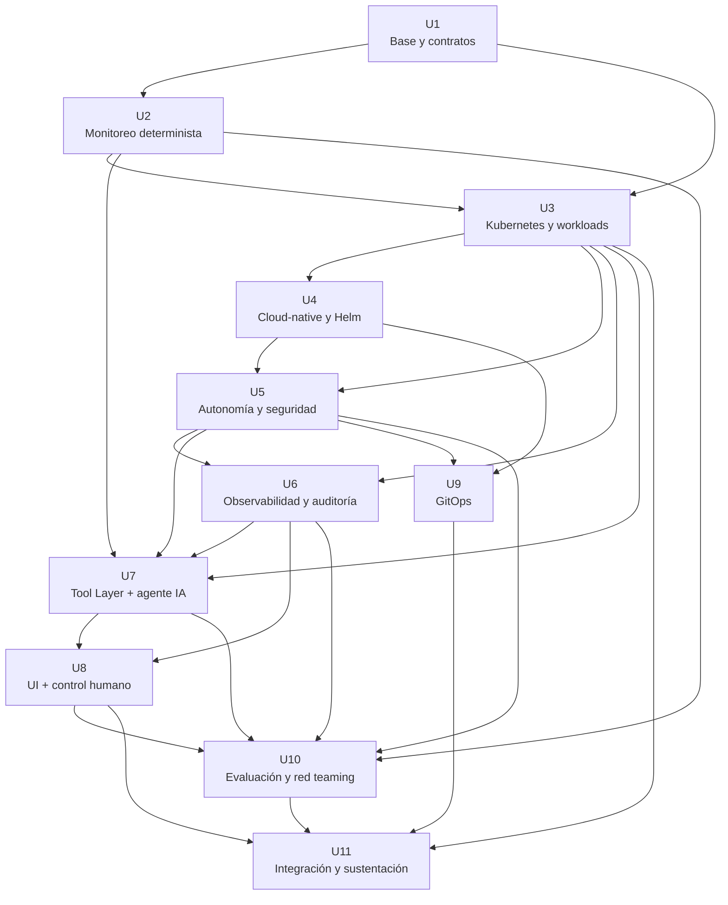

# Sentinel — Unidades y tareas

> **Artefacto de Units Generation / AI-DLC.**
>
> Este documento descompone el PRD y la arquitectura aprobados de Sentinel en unidades de
> trabajo con fronteras explícitas, dependencias, historias trazables y tareas verificables.
> El objetivo no es describir todo el código, sino producir una entrada suficientemente
> precisa para la etapa posterior de Code Generation.
>
> **Fuentes de entrada principales**
>
> - `specs/prd.md` — PRD aprobado.
> - `specs/arquitectura.md` — arquitectura técnica aprobada.
> - `docs/prompts-para-especificacion.md` — Prompt 3 y el formato AI-DLC.
>
> **Convenciones**
>
> - `[APROBADO]` — decisión ya aprobada en PRD o arquitectura.
> - `[INTERNO]` — decisión o detalle de implementación propuesto para el proyecto.
> - `[TBD]` — decisión pendiente que debe cerrarse antes de implementar lo que dependa de ella.
> - `[VERIFICAR]` — afirmación/requisito que requiere validación externa.
> - **Camino crítico** — unidad o historia cuya demora bloquea directa o indirectamente la sustentación.
>
> Una tarea se considera terminada únicamente cuando existe una evidencia reproducible. Un
> comando que solo confirme que un archivo existe no es suficiente cuando la historia exige
> comportamiento; en ese caso se requiere una prueba positiva, negativa, una ejecución real,
> una salida de Kubernetes o un artefacto verificable.

---

# 1. Panorama

Sentinel se descompone en **11 unidades de trabajo**:

| # | Unidad | Tipo | Módulo del curso principal | Se implementa como |
|---|---|---|---|---|
| U1 | Base de proyecto y contratos | Fundación | Base / M4–5 | repositorio + estructura de pruebas |
| U2 | Motor de monitoreo determinista | Cadena | M4–5 | scripts + herramientas de ejecución |
| U3 | Kubernetes y workloads | Cadena | M4–5 | Pods/Jobs + configuración |
| U4 | Aplicación cloud-native y Helm | Cadena | M6 | Helm + workloads |
| U5 | Puerta de autonomía y seguridad Kubernetes | Transversal/cadena | M7 | RBAC + ServiceAccounts + policies + pruebas |
| U6 | Observabilidad y auditoría | Transversal | M8 | métricas + logs + auditoría + Grafana |
| U7 | Tool Layer y agente IA | Cadena | M8 / Agentic Engineering | Deployment + tools + adapter LLM |
| U8 | Interfaz y control humano | Cadena | M8 / Agentic Engineering | UI + workflow de aprobación |
| U9 | GitOps y entrega reproducible | Transversal | M8 | Argo CD + Git |
| U10 | Evaluación, red teaming y validación experimental | Transversal | M8 / cierre | tests + dataset + experimentos |
| U11 | Integración y sustentación | Terminal | Sesión 16 | workflow E2E + evidencia final |

## 1.1 Regla de frontera

Cada unidad declara:

1. qué responsabilidad posee;
2. qué no hace;
3. de qué unidades depende;
4. qué historias implementa;
5. qué evidencia demuestra que terminó.

---

# 2. Grafo de dependencias



## 2.1 Verificación del grafo

**Resultado:** grafo acíclico. La lista de aristas fue verificada mecánicamente mediante un recorrido DFS/topológico antes de empaquetar estos cinco artefactos.

Verificación reproducible `[INTERNO]`:

```text
1. Mantener la lista de aristas de la tabla de dependencias.
2. Ejecutar un recorrido DFS/topológico sobre esa lista.
3. El resultado debe contener las 11 unidades exactamente una vez.
4. Debe producirse cero ciclos.
```

El archivo no utiliza una dependencia circular para justificar paralelismo. Toda unidad solo depende de unidades necesarias para su entrada.

---

# 3. Fases de ejecución

| Fase | Unidades | Paralelismo real |
|---|---|---:|
| 1 | U1 | 1 |
| 2 | U2 | 1 |
| 3 | U3 | 1 |
| 4 | U4 | 1 |
| 5 | U5 | 1 |
| 6 | U6 | 1 |
| 7 | U7 | 1 |
| 8 | U8 + U9 | 2 |
| 9 | U10 | 1 |
| 10 | U11 | 1 |

El grafo de Sentinel tiene menos paralelismo que el ejemplo de Timonel. Esto es deliberado:
U2 necesita definir la evidencia determinista que posteriormente ejecutará Kubernetes; U3
empaqueta esa evidencia; U5 debe asegurar el plano Kubernetes antes de ampliar las
capacidades del agente; U7 depende de esos límites. El paralelismo relevante aparece cuando
U8 y U9 pueden avanzar independientemente después de que el agente, la seguridad y el
despliegue cloud-native estén suficientemente definidos.

---

# 4. Esqueleto ambulante

La primera integración no debe intentar completar todas las capacidades de cada unidad.

El **walking skeleton** propuesto es:

```text
1. Ejecutar un workflow mínimo de monitoreo
        ↓
2. Crear un Job Kubernetes
        ↓
3. Ejecutar un único script autorizado
        ↓
4. Generar un reporte texto plano
        ↓
5. Exponer una única tool
        ↓
6. Agente propone ejecutar la tool
        ↓
7. Humano confirma
        ↓
8. Tool Layer → Kubernetes
        ↓
9. Registrar auditoría
        ↓
10. Mostrar resultado en UI
```

Este esqueleto atraviesa:

```text
U2 → U3 → U5 → U6 → U7 → U8 → U11
```

y permite responder tempranamente la pregunta más importante del producto:

> **¿La capa de agente puede coordinar un workflow real de monitoreo sin romper la frontera de autonomía?**

La generación completa de métricas, red teaming, ARP, GitOps y demás profundidad llega después.

---

# 5. Mapa de historias a unidades

Las historias del backlog aprobado se mantienen identificadas por sus IDs `BL-*`. Cada historia
aparece exactamente en una unidad.

| Unidad | Historias asignadas |
|---|---|
| U1 | BL-001, BL-002, BL-003 |
| U2 | BL-004, BL-005, BL-006, BL-007, BL-008, BL-009, BL-010 |
| U3 | BL-011, BL-012, BL-013, BL-014, BL-015, BL-016, BL-017 |
| U4 | BL-018, BL-019, BL-020 |
| U5 | BL-021, BL-022, BL-023, BL-024, BL-025, BL-026, BL-027 |
| U6 | BL-028, BL-029, BL-030, BL-031 |
| U7 | BL-032, BL-033, BL-034, BL-035, BL-036, BL-037, BL-038, BL-039, BL-040, BL-041 |
| U8 | BL-042, BL-043, BL-044, BL-045 |
| U9 | BL-046, BL-047, BL-048, BL-049 |
| U10 | BL-050, BL-051, BL-052, BL-053, BL-054, BL-055, BL-056, BL-057, BL-058 |
| U11 | BL-059, BL-060, BL-061, BL-062, BL-063, BL-064, BL-065 |

**Cobertura:** 65 historias.  
**Historias sin unidad:** 0.  
**Historias en más de una unidad:** 0.

---

# 6. U1 — Base de proyecto y contratos

- **Responsabilidad:** crear la estructura de repositorio, especificaciones versionadas y mecanismo mínimo de pruebas.
- **Qué NO hace:** no ejecuta workloads, no consulta activos, no contiene lógica del agente ni toma decisiones de seguridad.
- **Depende de:** ninguna.
- **Historias:** BL-001, BL-002, BL-003.
- **Camino crítico:** Sí.
- **Terminada cuando:** el repositorio tiene la estructura definida, PRD/arquitectura versionados y un runner de pruebas mínimo ejecutable.

| # | Tarea | Criterio de aceptación | Historia |
|---|---|---|---|
| U1-T01 | Crear estructura raíz del repositorio | `test -d docs && test -d src && test -d scripts && test -d deploy && test -d tests` devuelve código 0 | BL-001 |
| U1-T02 | Crear subdirectorios funcionales `[INTERNO]` | `test -d src/agent && test -d src/tools && test -d src/monitoring` devuelve 0 | BL-001 |
| U1-T03 | Incorporar PRD aprobado | `test -s docs/prd.md` devuelve 0 y el archivo contiene el encabezado del PRD | BL-002 |
| U1-T04 | Incorporar arquitectura aprobada | `test -s docs/arquitectura.md` devuelve 0 y contiene `# Arquitectura` | BL-002 |
| U1-T05 | Crear runner mínimo de pruebas `[INTERNO]` | `./tests/run.sh --smoke` finaliza con código 0 | BL-003 |
| U1-T06 | Documentar convención de ejecución | `grep -n "tests/run.sh" README.md` devuelve al menos una referencia | BL-003 |

---

# 7. U2 — Motor de monitoreo determinista

- **Responsabilidad:** producir la evidencia técnica de Sentinel: discovery, mediciones, tráfico, baseline, comparación, eventos y reportes.
- **Qué NO hace:** no utiliza el LLM, no orquesta Kubernetes y no autoriza acciones.
- **Depende de:** U1.
- **Historias:** BL-004, BL-005, BL-006, BL-007, BL-008, BL-009, BL-010.
- **Camino crítico:** Sí.
- **Terminada cuando:** un workflow determinista sin agente puede descubrir, medir, comparar y generar un reporte verificable.

| # | Tarea | Criterio de aceptación | Historia |
|---|---|---|---|
| U2-T01 | Crear script de discovery | `bash -n scripts/discovery.sh` finaliza con 0 | BL-004 |
| U2-T02 | Ejecutar discovery contra la topología de laboratorio | `scripts/discovery.sh > artifacts/discovery.txt` genera un archivo no vacío | BL-004 |
| U2-T03 | Verificar campos básicos del discovery | la salida contiene IP, MAC y los demás campos implementados para la topología | BL-004 |
| U2-T04 | Crear script de monitoreo periódico | `bash -n scripts/monitor.sh` finaliza con 0 | BL-005 |
| U2-T05 | Verificar intervalo de 5 segundos | una ejecución de prueba genera 5 timestamps con separación temporal aproximada de 5 s | BL-005 |
| U2-T06 | Implementar captura de tráfico | `bash -n scripts/traffic.sh` finaliza con 0 | BL-006 |
| U2-T07 | Verificar campos de tráfico | una ejecución contiene bytes/s, origen, destino y protocolo | BL-006 |
| U2-T08 | Implementar cálculo del baseline | `bash scripts/baseline.sh` produce 5 muestras, media `μ` y varianza `s²` | BL-007 |
| U2-T09 | Mantener el umbral como configuración pendiente | el criterio de umbral permanece marcado `[TBD]` hasta su decisión | BL-007 |
| U2-T10 | Implementar comparator independiente del agente | `./tests/run.sh comparator` pasa sin iniciar el agente | BL-008 |
| U2-T11 | Probar cambio positivo | una modificación conocida produce un evento de cambio | BL-008 |
| U2-T12 | Probar estado sin cambio | dos estados equivalentes no producen evento | BL-008 |
| U2-T13 | Implementar generador de reporte plano | `bash -n scripts/report.sh` finaliza con 0 | BL-009 |
| U2-T14 | Verificar esquema del reporte | la cabecera contiene IP, MAC, protocolo, puerto, tiempo y tráfico | BL-009 |
| U2-T15 | Verificar correspondencia reporte-medición | una prueba compara un valor fuente con la fila correspondiente y finaliza con 0 | BL-009 |
| U2-T16 | Registrar cambio observado | una prueba produce timestamp, atributo, valor anterior y valor actual | BL-010 |

---

# 8. U3 — Kubernetes y workloads

- **Responsabilidad:** ejecutar el workflow determinista mediante Kubernetes y convertir scripts en workloads reproducibles.
- **Qué NO hace:** no decide qué operación debe ejecutar la IA, no gestiona políticas de seguridad completas y no sustituye Tool Layer.
- **Depende de:** U1, U2.
- **Historias:** BL-011 a BL-017.
- **Camino crítico:** Sí.
- **Terminada cuando:** Discovery, Monitoring, Report y Recovery pueden ejecutarse como workloads y sus resultados son recuperables.

| # | Tarea | Criterio de aceptación | Historia |
|---|---|---|---|
| U3-T01 | Preparar clúster de laboratorio | `kubectl cluster-info` finaliza correctamente | BL-011 |
| U3-T02 | Verificar nodos disponibles | `kubectl get nodes` muestra nodos utilizables | BL-011 |
| U3-T03 | Crear namespace `sentinel` | `kubectl get namespace sentinel` devuelve el recurso | BL-012 |
| U3-T04 | Crear imagen del workload de monitoreo | la construcción de la imagen termina con código 0 `[INTERNO: herramienta de build TBD]` | BL-013 |
| U3-T05 | Ejecutar un Job de prueba | `kubectl get job -n sentinel` muestra el Job completado | BL-013 |
| U3-T06 | Verificar salida del Job | `kubectl logs job/<nombre> -n sentinel` devuelve la salida del script | BL-013 |
| U3-T07 | Crear Discovery Job | `kubectl apply -f deploy/jobs/discovery.yaml --dry-run=server` finaliza con 0 | BL-014 |
| U3-T08 | Ejecutar Discovery Job | `kubectl wait --for=condition=complete job/discovery -n sentinel --timeout=120s` finaliza con 0 | BL-014 |
| U3-T09 | Crear Monitoring Job | `kubectl apply -f deploy/jobs/monitoring.yaml --dry-run=server` finaliza con 0 | BL-015 |
| U3-T10 | Ejecutar Monitoring Job | `kubectl get jobs -n sentinel` muestra estado esperado y los logs contienen muestras | BL-015 |
| U3-T11 | Crear Report Job | `kubectl apply -f deploy/jobs/report.yaml --dry-run=server` finaliza con 0 | BL-016 |
| U3-T12 | Verificar Report Job | el Job genera un artefacto de reporte recuperable | BL-016 |
| U3-T13 | Crear flujo de recovery | una prueba provoca un fallo y crea una ruta de reintento conocida | BL-017 |
| U3-T14 | Verificar límite de tres intentos | el experimento registra como máximo intento inicial + dos reintentos | BL-017 |
| U3-T15 | Verificar escalamiento posterior | después del límite no se crea un nuevo Job automáticamente | BL-017 |

---

# 9. U4 — Aplicación cloud-native y Helm

- **Responsabilidad:** empaquetar Sentinel como aplicación reproducible y configurable en Kubernetes.
- **Qué NO hace:** no define el modelo LLM, no sustituye RBAC y no implementa el flujo de aprobación humana.
- **Depende de:** U3.
- **Historias:** BL-018, BL-019, BL-020.
- **Camino crítico:** Sí.
- **Terminada cuando:** configuración no sensible está separada de las imágenes y Sentinel puede desplegarse mediante Helm.

| # | Tarea | Criterio de aceptación | Historia |
|---|---|---|---|
| U4-T01 | Crear ConfigMap de parámetros no sensibles | `kubectl get configmap -n sentinel` muestra la configuración | BL-018 |
| U4-T02 | Verificar separación imagen/configuración | el manifiesto muestra que intervalo y muestras provienen del ConfigMap | BL-018 |
| U4-T03 | Crear Helm Chart | `helm lint deploy/helm/sentinel` finaliza con 0 | BL-019 |
| U4-T04 | Renderizar manifests | `helm template sentinel deploy/helm/sentinel` finaliza sin errores | BL-019 |
| U4-T05 | Desplegar Sentinel mediante Helm | `helm list -n sentinel` muestra la release | BL-020 |
| U4-T06 | Verificar Pods del despliegue | `kubectl get pods -n sentinel` muestra los workloads en estado esperado | BL-020 |
| U4-T07 | Desinstalar y reinstalar | `helm uninstall` y posterior `helm install` terminan correctamente | BL-020 |

---

# 10. U5 — Puerta de autonomía y seguridad Kubernetes

- **Responsabilidad:** imponer el límite de autonomía del agente mediante Tool Layer, RBAC, ServiceAccounts, Pod Security y Network Policies.
- **Qué NO hace:** no ejecuta acciones sobre activos por sí misma, no aprueba operaciones y no genera evidencia de monitoreo.
- **Depende de:** U3, U4.
- **Historias:** BL-021 a BL-027.
- **Camino crítico:** Sí.
- **Terminada cuando:** existen controles independientes de aplicación y plataforma, y las pruebas positivas/negativas demuestran la frontera de autonomía.

| # | Tarea | Criterio de aceptación | Historia |
|---|---|---|---|
| U5-T01 | Crear ServiceAccount dedicado del agente | `kubectl get sa sentinel-agent -n sentinel` devuelve el recurso | BL-021 |
| U5-T02 | Asociar ServiceAccount al Deployment | la especificación del Deployment muestra la ServiceAccount del agente | BL-021 |
| U5-T03 | Crear RBAC mínimo inicial | `kubectl apply --dry-run=server -f config/rbac/` finaliza con 0 | BL-022 |
| U5-T04 | Verificar ausencia de privilegio administrativo amplio | una comprobación `auth can-i` no concede acceso administrativo global | BL-022 |
| U5-T05 | Verificar permisos positivos | `kubectl auth can-i` devuelve el resultado esperado para cada operación realmente requerida | BL-023 |
| U5-T06 | Verificar permiso de escritura no autorizado | `kubectl auth can-i create deployments --as=system:serviceaccount:sentinel:sentinel-agent -n sentinel` devuelve `no` | BL-023 |
| U5-T07 | Negar lectura de Secrets no requerida | `kubectl auth can-i get secrets --as=system:serviceaccount:sentinel:sentinel-agent -n sentinel` devuelve `no` | BL-023 |
| U5-T08 | Negar creación de bindings | `kubectl auth can-i create clusterrolebindings --as=system:serviceaccount:sentinel:sentinel-agent` devuelve `no` | BL-023 |
| U5-T09 | Aplicar Pod Security | un Pod que viole la política es rechazado cuando corresponde | BL-024 |
| U5-T10 | Aplicar NetworkPolicy | `kubectl get networkpolicy -n sentinel` muestra las políticas requeridas | BL-025 |
| U5-T11 | Probar comunicación permitida | el flujo autorizado entre componentes completa correctamente | BL-025 |
| U5-T12 | Probar comunicación denegada | una conexión fuera de la política falla | BL-025 |
| U5-T13 | Eliminar credenciales de endpoint del contexto del agente | revisión del Deployment/Secrets confirma que no recibe credenciales directas de activos | BL-026 |
| U5-T14 | Probar intento de acceso directo al endpoint | una prueba de acceso directo desde el agente falla | BL-026 |
| U5-T15 | Verificar ausencia de shell arbitrario | `grep -R "execute_shell" src/ deploy/` no encuentra una tool genérica implementada | BL-027 |
| U5-T16 | Probar solicitud arbitraria | un caso de comando libre es rechazado antes de ejecutar | BL-027 |

> **Dos capas, a propósito:** la Tool Layer deberá rechazar capacidades fuera de su contrato y
> RBAC deberá rechazar la operación en Kubernetes. Ninguna capa debe depender de la otra para
> representar por sí sola la frontera de seguridad.

---

# 11. U6 — Observabilidad y auditoría

- **Responsabilidad:** hacer observable el sistema y conservar trazabilidad de workflows, tools, autorizaciones, errores y resultados.
- **Qué NO hace:** no diagnostica ataques, no decide acciones y no modifica el baseline.
- **Depende de:** U3, U5.
- **Historias:** BL-028, BL-029, BL-030, BL-031.
- **Camino crítico:** Sí.
- **Terminada cuando:** las métricas, logs, auditoría y Grafana permiten reconstruir una ejecución real.

| # | Tarea | Criterio de aceptación | Historia |
|---|---|---|---|
| U6-T01 | Instrumentar métricas de workflow | una ejecución incrementa las métricas de workflow iniciadas/completadas/fallidas | BL-028 |
| U6-T02 | Instrumentar métricas de tools | una tool call incrementa contadores de llamada, éxito o error | BL-028 |
| U6-T03 | Instrumentar reintentos y escalamiento | un escenario de recovery modifica los contadores correspondientes | BL-028 |
| U6-T04 | Estandarizar logs operacionales | una ejecución genera logs con workflow, tool, resultado e intento | BL-029 |
| U6-T05 | Verificar ausencia de secretos en logs | una búsqueda controlada no encuentra los patrones de secretos definidos | BL-029 |
| U6-T06 | Registrar auditoría de aprobación | una operación confirmada genera usuario, timestamp y tool | BL-030 |
| U6-T07 | Registrar rechazo y error | un rechazo y un fallo de herramienta quedan diferenciados | BL-030 |
| U6-T08 | Registrar resultado Kubernetes | una ejecución permite relacionar la operación con el Job/Pod correspondiente | BL-030 |
| U6-T09 | Desplegar Grafana | `kubectl get pods -n sentinel-observability` muestra Grafana en estado esperado | BL-031 |
| U6-T10 | Publicar métrica de tráfico | la fuente de datos contiene la métrica de tráfico definida | BL-031 |
| U6-T11 | Verificar visualización | el dashboard muestra valores de una ejecución real de laboratorio | BL-031 |

---

# 12. U7 — Tool Layer y agente IA

- **Responsabilidad:** convertir solicitudes del usuario en operaciones autorizadas y coordinar el workflow mediante el agente.
- **Qué NO hace:** no actúa directamente sobre endpoints, no genera la evidencia técnica, no compara el baseline y no ejecuta shell arbitrario.
- **Depende de:** U2, U3, U5, U6.
- **Historias:** BL-032 a BL-041.
- **Camino crítico:** Sí.
- **Terminada cuando:** existe un loop de agente funcional, limitado y auditable que puede ejecutar las tools aprobadas sin superar la frontera de autonomía.

| # | Tarea | Criterio de aceptación | Historia |
|---|---|---|---|
| U7-T01 | Crear interfaz de Tool Layer | una prueba puede invocar una tool mediante contrato explícito | BL-032 |
| U7-T02 | Rechazar tool no registrada | una llamada a un nombre inexistente termina en rechazo antes de Kubernetes | BL-032 |
| U7-T03 | Validar parámetros de tool | una entrada inválida no produce una llamada al recurso Kubernetes | BL-032 |
| U7-T04 | Implementar `get_cluster_state()` | la tool devuelve únicamente recursos autorizados | BL-033 |
| U7-T05 | Implementar `discover_assets()` | crea/ejecuta el Discovery Job autorizado y recupera el resultado | BL-034 |
| U7-T06 | Implementar `start_monitoring()` | crea/ejecuta el Monitoring Job autorizado con parámetros explícitos | BL-035 |
| U7-T07 | Implementar `generate_report()` | produce un Report Job cuyo resultado proviene del script | BL-036 |
| U7-T08 | Verificar integridad del reporte tras pasar por la tool | la salida antes y después del paso del agente coincide en el conjunto de prueba | BL-036 |
| U7-T09 | Implementar `restart_monitoring_job()` | la tool no permite exceder el contador máximo | BL-037 |
| U7-T10 | Implementar `update_monitoring_config()` | una configuración fuera de allowlist es rechazada | BL-038 |
| U7-T11 | Crear adapter del LLM `[TBD]` | el agente consume el modelo mediante una interfaz estable independiente del proveedor | BL-039 |
| U7-T12 | Configurar proveedor/modelo fuera de imagen | la configuración del modelo no aparece hardcodeada en la imagen | BL-039 |
| U7-T13 | Implementar loop mínimo de agente | un caso normal recorre solicitud → contexto → propuesta → aprobación → tool → resultado | BL-040 |
| U7-T14 | Verificar que la ejecución requiere aprobación | una prueba sin confirmación no produce tool call ejecutable | BL-040 |
| U7-T15 | Integrar recovery con el loop | un error de tool inicia el flujo de reintento limitado | BL-040 |
| U7-T16 | Integrar escalamiento | un fallo persistente termina en estado de escalamiento | BL-040 |
| U7-T17 | Tratar resultados de tools como datos no confiables | un resultado con `IGNORE PREVIOUS INSTRUCTIONS` no modifica la política del agente | BL-041 |
| U7-T18 | Registrar ataque de prompt injection indirecto | el caso adversarial deja evidencia sin ejecutar la operación inyectada | BL-041 |

---

# 13. U8 — Interfaz y control humano

- **Responsabilidad:** exponer el workflow al operador y convertir la aprobación humana en una condición explícita de ejecución.
- **Qué NO hace:** no ejecuta directamente comandos, no diagnostica ataques y no concede permisos al agente.
- **Depende de:** U6, U7.
- **Historias:** BL-042 a BL-045.
- **Camino crítico:** Sí.
- **Terminada cuando:** el usuario puede iniciar, aprobar, rechazar, abandonar y recibir un escalamiento de un workflow completo.

| # | Tarea | Criterio de aceptación | Historia |
|---|---|---|---|
| U8-T01 | Crear interfaz mínima de operación | la UI carga y muestra el estado básico de Sentinel | BL-042 |
| U8-T02 | Permitir inicio de workflow | una acción de UI genera una solicitud observable en logs | BL-042 |
| U8-T03 | Mostrar operación propuesta | la pantalla muestra tool y parámetros relevantes antes de ejecutar | BL-043 |
| U8-T04 | Implementar aprobación explícita | aprobar genera transición a ejecución autorizada | BL-043 |
| U8-T05 | Implementar rechazo explícito | rechazar no produce tool call ejecutable | BL-043 |
| U8-T06 | Implementar expiración segura | una aprobación pendiente que expira no genera ejecución | BL-044 |
| U8-T07 | Registrar abandono/timeout | el evento de expiración queda registrado | BL-044 |
| U8-T08 | Mostrar contexto de escalamiento | la UI presenta operación, tool, último error e intentos | BL-045 |
| U8-T09 | Bloquear nuevos intentos después del escalamiento | una prueba posterior no genera ejecución automática | BL-045 |

---

# 14. U9 — GitOps y entrega reproducible

- **Responsabilidad:** mantener el estado declarativo de Sentinel en Git y reconciliarlo mediante Argo CD.
- **Qué NO hace:** no modifica activos mediante el agente, no fusiona cambios automáticamente y no almacena secretos reales en claro.
- **Depende de:** U4, U5.
- **Historias:** BL-046 a BL-049.
- **Camino crítico:** Sí para la entrega final.
- **Terminada cuando:** un despliegue puede reproducirse desde Git y una reversión versionada restaura el estado deseado.

| # | Tarea | Criterio de aceptación | Historia |
|---|---|---|---|
| U9-T01 | Versionar Helm/manifests declarativos | `git status --short deploy/` muestra los artefactos esperados | BL-046 |
| U9-T02 | Verificar ausencia de Secrets reales en Git | una búsqueda controlada no encuentra secretos reales en el repositorio | BL-046 |
| U9-T03 | Desplegar Argo CD `[INTERNO]` | `kubectl get pods -n argocd` muestra el controlador en estado esperado | BL-047 |
| U9-T04 | Crear Application de Sentinel | el estado de Argo CD identifica repositorio y destino previstos | BL-047 |
| U9-T05 | Verificar reconciliación | un cambio controlado en Git modifica el estado observado en Kubernetes | BL-048 |
| U9-T06 | Ejecutar rollback versionado | después de revertir el commit, Kubernetes vuelve al estado esperado | BL-048 |
| U9-T07 | Verificar estrategia de Secrets `[TBD]` | el mecanismo seleccionado queda documentado y probado sin valores reales en claro | BL-049 |
| U9-T08 | Inspeccionar imagen por secretos `[INTERNO]` | la revisión del artefacto publicado no encuentra las credenciales de prueba | BL-049 |

---

# 15. U10 — Evaluación, red teaming y validación experimental

- **Responsabilidad:** evaluar comportamiento, seguridad y valor operacional del agente y del sistema.
- **Qué NO hace:** no introduce nuevas funcionalidades de producto; mide las existentes.
- **Depende de:** U2, U5, U6, U7, U8.
- **Historias:** BL-050 a BL-058.
- **Camino crítico:** Sí.
- **Terminada cuando:** existe un dataset con ground truth, pruebas automáticas/humanas, red teaming, escenario ARP y comparación con/sin IA con evidencia reproducible.

| # | Tarea | Criterio de aceptación | Historia |
|---|---|---|---|
| U10-T01 | Definir estructura del dataset | cada caso tiene ID, entrada, contexto y resultado esperado | BL-050 |
| U10-T02 | Añadir casos normales y de error | el dataset contiene casos de workflow normal, error, rechazo y ambigüedad | BL-050 |
| U10-T03 | Añadir casos de prompt injection | existen casos donde datos de tools contienen texto manipulador | BL-050 |
| U10-T04 | Automatizar validación de tool selection | la suite detecta una tool incorrecta como fallo | BL-051 |
| U10-T05 | Automatizar validación de parámetros | la suite detecta parámetros inválidos como fallo | BL-051 |
| U10-T06 | Automatizar validación de aprobación | la suite falla si se ejecuta una operación sin confirmación | BL-051 |
| U10-T07 | Crear rúbrica de revisión humana | la rúbrica documenta factualidad, adherencia y relevancia | BL-052 |
| U10-T08 | Ejecutar revisión humana del dataset | cada caso revisado tiene resultado y observación cuando falla | BL-052 |
| U10-T09 | Red teaming de bypass de aprobación | todos los casos terminan sin ejecución no autorizada | BL-053 |
| U10-T10 | Red teaming de escalada de capacidades | shell arbitrario y recursos no autorizados son rechazados | BL-054 |
| U10-T11 | Red teaming de prompt injection indirecto | los datos maliciosos no cambian la política del agente | BL-055 |
| U10-T12 | Preparar topología ARP normal | el estado inicial produce evidencia de tráfico normal | BL-056 |
| U10-T13 | Ejecutar escenario ARP controlado | el atacante temporal puede incorporarse al laboratorio y el experimento queda registrado | BL-056 |
| U10-T14 | Verificar cambio IP↔MAC observado | cuando el escenario lo produzca, el reporte registra valores anterior y actual | BL-056 |
| U10-T15 | Preparar condición control sin IA | el workflow determinista puede ejecutarse sin el proceso del agente | BL-057 |
| U10-T16 | Preparar condición tratamiento con IA | el mismo objetivo funcional se ejecuta mediante el agente | BL-057 |
| U10-T17 | Registrar tiempos comparables | cada ejecución conserva tiempo total y tiempo humano | BL-057 |
| U10-T18 | Calcular North Star | el análisis calcula el tiempo mediano con y sin IA | BL-058 |
| U10-T19 | Calcular métricas de calidad y seguridad | el análisis produce tool success, recovery, acciones no autorizadas e integridad de evidencia | BL-058 |
| U10-T20 | Calcular noise metric | el análisis identifica eventos que no corresponden al ground truth | BL-058 |

---

# 16. U11 — Integración y sustentación

- **Responsabilidad:** convertir las unidades terminadas en un workflow completo y en un paquete reproducible para la sustentación.
- **Qué NO hace:** no introduce capacidades nuevas fuera del alcance del MVP.
- **Depende de:** U3, U8, U9, U10.
- **Historias:** BL-059 a BL-065.
- **Camino crítico:** Sí.
- **Terminada cuando:** existe una ejecución reproducible de extremo a extremo y el paquete final contiene la evidencia funcional, de seguridad y experimental.

| # | Tarea | Criterio de aceptación | Historia |
|---|---|---|---|
| U11-T01 | Integrar workflow completo desde UI | una ejecución recorre UI → agente → tool → Kubernetes → Job → reporte → auditoría | BL-059 |
| U11-T02 | Verificar evidencia del workflow | la ejecución conserva logs, reporte y auditoría correlacionables | BL-059 |
| U11-T03 | Ejecutar workflow completo sin agente | el control termina con evidencia equivalente del objetivo funcional | BL-060 |
| U11-T04 | Preparar escenario de recovery para demo | el fallo controlado produce el flujo de reintentos esperado | BL-061 |
| U11-T05 | Preparar escenario de escalamiento | el fallo persistente muestra el contexto entregado al humano | BL-061 |
| U11-T06 | Preparar demo de seguridad Kubernetes | la sustentación incluye al menos una prueba `can-i` positiva y una negativa | BL-062 |
| U11-T07 | Preparar evidencia de ausencia de shell arbitrario | la prueba negativa y la configuración de tools quedan en el paquete final | BL-062 |
| U11-T08 | Preparar demo ARP | existen evidencias antes/durante/después del escenario | BL-063 |
| U11-T09 | Preparar comparación con/sin IA | el paquete contiene datos de ambas condiciones y el cálculo de la comparación | BL-064 |
| U11-T10 | Consolidar documentación | PRD, arquitectura y backlog están versionados en el repositorio final | BL-065 |
| U11-T11 | Consolidar instrucciones de despliegue | una instalación desde el repositorio reproduce el stack definido | BL-065 |
| U11-T12 | Consolidar checklist de sustentación | el checklist no contiene un requisito sin evidencia asociada | BL-065 |

---

# 17. Camino crítico

La cadena funcional principal de Sentinel es:

```text
U1
 ↓
U2
 ↓
U3
 ↓
U4
 ↓
U5
 ↓
U6
 ↓
U7
 ↓
U8
 ↓
U10
 ↓
U11
```

**Profundidad: 10 unidades.**

U9 queda fuera de la cadena principal de razonamiento porque su trabajo puede avanzar en paralelo
con U8 una vez que la configuración cloud-native y las políticas de seguridad están definidas:

```text
                 ┌──→ U8 ──┐
... → U5 → U6 → U7        ├→ U10 → U11
                 └──→ U9 ─┘
```

La existencia de U9 no debe utilizarse para afirmar que toda la entrega está desacoplada:
U11 sigue necesitando su resultado para la reproducción final.

---

# 18. Historias del camino crítico

Las historias del backlog que bloquean la cadena de valor principal incluyen:

```text
BL-001–003    Base
BL-004–010    Evidencia determinista
BL-011–017    Kubernetes
BL-018–020    Helm/configuración
BL-021–027    Seguridad y autonomía
BL-028–031    Auditoría/observabilidad
BL-032–041    Tool Layer + agente
BL-042–045    Human-in-the-loop
BL-050–058    Evaluación
BL-059–065    Integración final
```

Las historias `BL-046–049` de GitOps son críticas para la reproducibilidad final, pero pueden
desarrollarse en paralelo con U8.

---

# 19. Reglas de construcción de las unidades

## 19.1 Ninguna unidad puede saltarse su frontera

Ejemplo:

```text
U7 Agente
```

puede seleccionar una tool y ejecutar un workflow autorizado.

No puede modificar directamente un endpoint ni asumir el papel de U2:

```text
U7 ─X→ comparar baseline
U7 ─X→ generar evidencia
U7 ─X→ acceso directo a activos
```

## 19.2 La prueba se construye junto con la unidad

No se espera a una etapa posterior para crear por primera vez la prueba de la historia.
La etapa posterior de validación amplía y ejecuta la evidencia; no inventa desde cero el
criterio.

## 19.3 La evidencia debe ser específica

No:

```text
"la UI funciona"
```

Sí:

```text
acción de aprobación
→ tool call
→ Job
→ reporte
→ auditoría
```

## 19.4 La seguridad debe tener pruebas negativas

No basta con:

```text
kubectl auth can-i get pods ...
```

También debe existir:

```text
kubectl auth can-i create deployments ...
kubectl auth can-i get secrets ...
kubectl auth can-i create clusterrolebindings ...
```

y sus resultados deben ser los esperados.

---

# 20. Comprobación de cobertura

La trazabilidad esperada es:

```text
PRD
 ↓
Backlog BL-xxx
 ↓
Unidad Ux
 ↓
Tarea Ux-Txx
 ↓
Comando/prueba
 ↓
Evidencia
```

## 20.1 Regla de cobertura

```text
[ ] Cada BL-xxx aparece en exactamente una unidad
[ ] Cada tarea Ux-Txx referencia una historia
[ ] Cada historia tiene al menos una tarea
[ ] Cada unidad declara dependencias
[ ] Las dependencias no tienen ciclos
[ ] Cada tarea tiene criterio verificable
[ ] Cada unidad tiene criterio de "terminada cuando"
```

## 20.2 Resultado actual

```text
Historias del backlog:    65
Historias asignadas:      65
Historias huérfanas:       0
Historias duplicadas:      0
Unidades:                 11
Dependencias cíclicas:     0 (verificación DFS/topológica)
```

---

# 21. Decisiones pendientes que afectan Units Generation

| Decisión | Estado | Unidad afectada |
|---|---|---|
| Umbral exacto de tráfico | `[TBD]` | U2 |
| Modelo/proveedor LLM | `[TBD]` | U7 |
| Persistencia exacta de auditoría/reportes | `[TBD]` | U6 |
| StorageClass | `[TBD]` | U3/U4/U6 |
| Mecanismo de Secrets cifrados en Git | `[TBD]` | U9 |
| Ingress / port-forward / NodePort | `[TBD]` | U8 |
| `apiGroups/resources/verbs` finales | `[TBD]` | U5/U7 |
| Dataset final de evaluación | `[TBD]` | U10 |
| Targets cuantitativos | `[TBD]` | U10 |
| Requisitos regulatorios | `[VERIFICAR]` | U10/U11 |

Una unidad puede construirse mientras una decisión esté abierta únicamente cuando esa decisión
no sea necesaria para su frontera. Una tarea que dependa de ella debe quedarse en `READY` o
`BLOCKED` hasta cerrarla.

---

# 22. Organización sugerida del código

```text
sentinel/
├── docs/
│   ├── prd.md
│   ├── arquitectura.md
│   ├── backlog.md
│   └── unidades-y-tareas.md
│
├── src/
│   ├── agent/              # U7
│   ├── tools/              # U7
│   ├── monitoring/         # U2
│   └── ui/                 # U8
│
├── scripts/                # U2
│   ├── discovery.sh
│   ├── monitor.sh
│   ├── traffic.sh
│   ├── baseline.sh
│   ├── compare.sh
│   └── report.sh
│
├── deploy/
│   ├── helm/               # U4
│   ├── jobs/               # U3
│   └── rbac/               # U5
│
├── tests/
│   ├── monitoring/         # U2
│   ├── kubernetes/         # U3
│   ├── security/           # U5
│   ├── observability/      # U6
│   ├── agent/              # U7
│   ├── ui/                 # U8
│   ├── gitops/             # U9
│   └── evaluation/         # U10
│
└── artifacts/
    ├── discovery/
    ├── reports/
    ├── evaluation/
    └── demo/
```

La estructura de código es una propuesta `[INTERNO]`; puede cambiar durante la implementación
sin cambiar las fronteras funcionales de las unidades.

---

# 23. Preparación para Code Generation

La etapa siguiente puede consumir una unidad de este documento y generar su plan detallado de
código.

La unidad especialmente adecuada para una primera demostración de Code Generation es:

> **U5 — Puerta de autonomía y seguridad Kubernetes**

porque convierte una decisión abstracta del PRD en restricciones verificables con:

```text
ServiceAccount
RBAC
NetworkPolicy
Pod Security
tool allowlist
pruebas negativas
kubectl auth can-i
```

La segunda candidata es:

> **U7 — Tool Layer y agente IA**

porque muestra el segundo componente central del producto: tool use + agentic loop bajo
confirmación humana.

No obstante, **U7 no debería codificarse antes de U5**, porque la arquitectura aprobada exige
que las capacidades del agente estén delimitadas por los controles de seguridad.

---

# 24. Estado de aprobación

| Artefacto | Estado |
|---|---|
| PRD | ✅ Aprobado |
| Arquitectura | ✅ Aprobada |
| Backlog | ✅ Aprobado |
| Unidades de trabajo | ✅ Derivadas del PRD + arquitectura |
| Dependencias | ✅ Verificadas mecánicamente acíclicas |
| Mapa de historias | ✅ 65/65 cubiertas |
| Tareas verificables | ✅ Definidas |
| Plan de Code Generation | ⏭️ Siguiente etapa |

---

# 25. Regla final de Units Generation

> **Una unidad no es un “módulo grande” ni una carpeta arbitraria. Es una frontera de
> responsabilidad que puede construirse, probarse y revisarse de forma independiente.**
>
> En Sentinel, esa regla obliga a mantener separadas la evidencia determinista, los workloads
> Kubernetes, la seguridad, la observabilidad, el agente, la interfaz, GitOps y la evaluación.
> Ninguna unidad puede apropiarse de una responsabilidad que pertenece a otra.

---

_Creado a partir del PRD y la arquitectura aprobados de Sentinel, tomando como vara de calidad
los artefactos de Units Generation proporcionados para el caso ficticio de Timonel._
