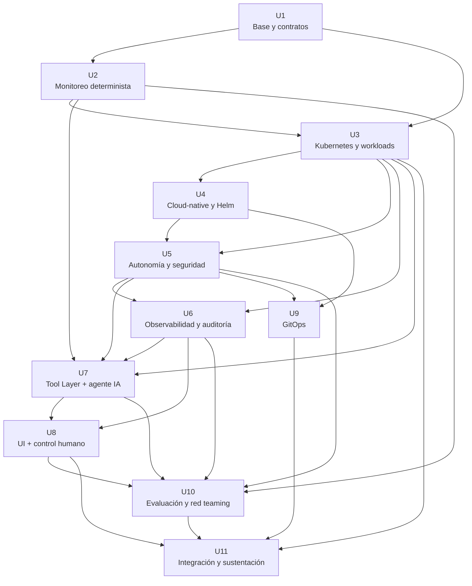

# Sentinel — Unit of Work Dependency

> Artefacto de **Units Generation** de AI-DLC.
> Declara el grafo, las fases, el walking skeleton, el paralelismo real y el camino crítico.

# 2. Grafo de dependencias



## 2.1 Verificación declarada

**Resultado esperado:** grafo acíclico.

Verificación propuesta `[INTERNO]`:

```text
1. Mantener la lista de aristas de la tabla de dependencias.
2. Ejecutar un recorrido DFS/topológico sobre esa lista.
3. El resultado debe contener las 11 unidades exactamente una vez.
4. Debe producirse cero ciclos.
```

El archivo no utiliza una dependencia circular para justificar paralelismo. Toda unidad solo depende de unidades necesarias para su entrada.

---

# 3. Fases de ejecución

| Fase | Unidades | Paralelismo real |
|---|---|---:|
| 1 | U1 | 1 |
| 2 | U2 | 1 |
| 3 | U3 | 1 |
| 4 | U4 | 1 |
| 5 | U5 | 1 |
| 6 | U6 | 1 |
| 7 | U7 | 1 |
| 8 | U8 + U9 | 2 |
| 9 | U10 | 1 |
| 10 | U11 | 1 |

El grafo de Sentinel tiene menos paralelismo que el ejemplo de Timonel. Esto es deliberado:
U2 necesita definir la evidencia determinista que posteriormente ejecutará Kubernetes; U3
empaqueta esa evidencia; U5 debe asegurar el plano Kubernetes antes de ampliar las
capacidades del agente; U7 depende de esos límites. El paralelismo relevante aparece cuando
U8 y U9 pueden avanzar independientemente después de que el agente, la seguridad y el
despliegue cloud-native estén suficientemente definidos.

---

# 4. Esqueleto ambulante

La primera integración no debe intentar completar todas las capacidades de cada unidad.

El **walking skeleton** propuesto es:

```text
1. Ejecutar un workflow mínimo de monitoreo
        ↓
2. Crear un Job Kubernetes
        ↓
3. Ejecutar un único script autorizado
        ↓
4. Generar un reporte texto plano
        ↓
5. Exponer una única tool
        ↓
6. Agente propone ejecutar la tool
        ↓
7. Humano confirma
        ↓
8. Tool Layer → Kubernetes
        ↓
9. Registrar auditoría
        ↓
10. Mostrar resultado en UI
```

Este esqueleto atraviesa:

```text
U2 → U3 → U5 → U6 → U7 → U8 → U11
```

y permite responder tempranamente la pregunta más importante del producto:

> **¿La capa de agente puede coordinar un workflow real de monitoreo sin romper la frontera de autonomía?**

La generación completa de métricas, red teaming, ARP, GitOps y demás profundidad llega después.

---

## Verificación mecánica del grafo

El grafo declarado en este paquete fue verificado mediante un recorrido DFS/topológico.

- Nodos: 11
- Aristas: 25
- Ciclos detectados: 0
- Orden topológico válido: `U1, U2, U3, U4, U5, U9, U6, U7, U8, U10, U11`
- Resultado: **ACÍCLICO**.


---

# 17. Camino crítico

La cadena funcional principal de Sentinel es:

```text
U1
 ↓
U2
 ↓
U3
 ↓
U4
 ↓
U5
 ↓
U6
 ↓
U7
 ↓
U8
 ↓
U10
 ↓
U11
```

**Profundidad: 10 unidades.**

U9 queda fuera de la cadena principal de razonamiento porque su trabajo puede avanzar en paralelo
con U8 una vez que la configuración cloud-native y las políticas de seguridad están definidas:

```text
                 ┌──→ U8 ──┐
... → U5 → U6 → U7        ├→ U10 → U11
                 └──→ U9 ─┘
```

La existencia de U9 no debe utilizarse para afirmar que toda la entrega está desacoplada:
U11 sigue necesitando su resultado para la reproducción final.

---

# 18. Historias del camino crítico

Las historias del backlog que bloquean la cadena de valor principal incluyen:

```text
BL-001–003    Base
BL-004–010    Evidencia determinista
BL-011–017    Kubernetes
BL-018–020    Helm/configuración
BL-021–027    Seguridad y autonomía
BL-028–031    Auditoría/observabilidad
BL-032–041    Tool Layer + agente
BL-042–045    Human-in-the-loop
BL-050–058    Evaluación
BL-059–065    Integración final
```

Las historias `BL-046–049` de GitOps son críticas para la reproducibilidad final, pero pueden
desarrollarse en paralelo con U8.

---

## Orden de construcción recomendado

```text
U1 → U2 → U3 → U4 → U5 → U6 → U7 → U8 → U10 → U11
                         └──────────────→ U9 ────────┘
```

U9 puede avanzar en paralelo después de que U4/U5 hayan fijado sus entradas cloud-native y de seguridad; U11 espera a U9 y U10 antes del paquete final.

## Regla de validación del grafo

Una edición de dependencias debe volver a ejecutar una verificación topológica. No se considera válido un grafo solamente porque Mermaid se renderice sin errores.
